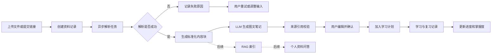
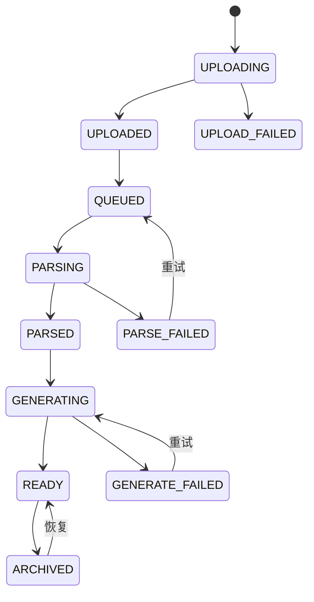
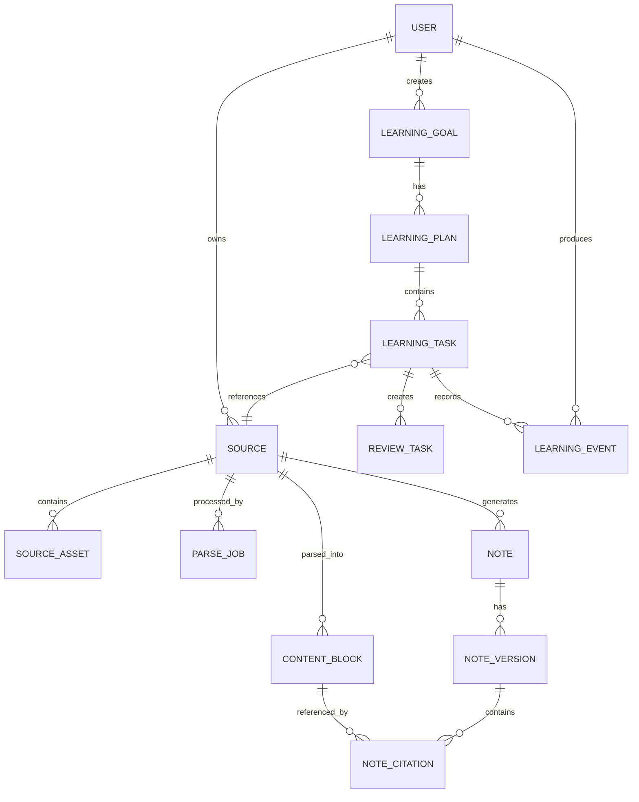
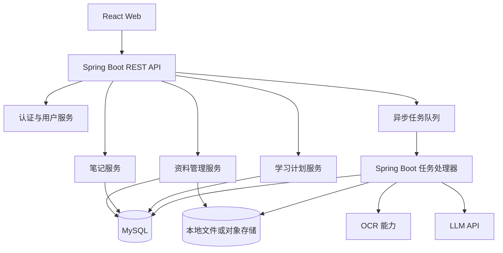
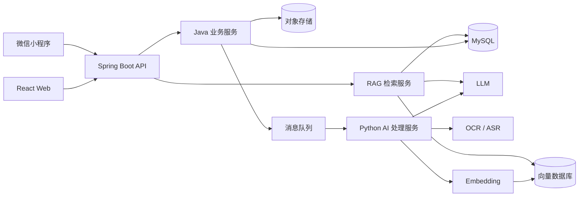

# AI 学习资料处理与智能复习系统产品需求文档

> 文档类型：产品需求文档（PRD）<br>
> 产品代号：AI Sources Handler<br>
> 文档版本：V1.0<br>
> 文档状态：需求初稿<br>
> 创建日期：2026-06-06<br>
> 目标读者：产品、设计、前端、后端、测试、AI 应用开发人员

---

## 目录

1. [文档说明](#1-文档说明)
2. [产品目标](#2-产品目标)
3. [用户与使用场景](#3-用户与使用场景)
4. [产品原则](#4-产品原则)
5. [产品范围](#5-产品范围)
6. [整体业务流程](#6-整体业务流程)
7. [信息架构](#7-信息架构)
8. [功能需求](#8-功能需求)
9. [关键页面需求](#9-关键页面需求)
10. [数据模型](#10-数据模型)
11. [系统架构建议](#11-系统架构建议)
12. [接口能力清单](#12-接口能力清单)
13. [AI 生成策略与质量要求](#13-ai-生成策略与质量要求)
14. [非功能需求](#14-非功能需求)
15. [异常与降级策略](#15-异常与降级策略)
16. [埋点与产品指标](#16-埋点与产品指标)
17. [MVP 验收范围](#17-mvp-验收范围)
18. [版本路线图](#18-版本路线图)
19. [风险与应对](#19-风险与应对)
20. [待确认事项](#20-待确认事项)
21. [术语表](#21-术语表)
22. [需求变更记录](#22-需求变更记录)

---

## 1. 文档说明

### 1.1 编写目的

本文档用于明确“AI 学习资料处理与智能复习系统”的产品目标、首期范围、核心流程、功能需求、数据要求、非功能要求与迭代计划，作为后续原型设计、技术设计、任务拆分、开发测试和验收的共同依据。

### 1.2 产品一句话定义

一个面向 AI 编程与 Java 面试学习者的个人知识学习助手，可统一接收不同格式的学习资料，解析并生成可追溯的图文 Markdown 笔记，同时根据学习行为规划学习与复习任务。

### 1.3 需求背景

用户在准备 AI 编程和 Java 基础相关面试时，学习资料通常分散在 PDF、纯文本、截图和视频链接中，存在以下问题：

- 资料格式不统一，查找与阅读成本高。
- 长文档与视频内容难以快速提取重点。
- 手工整理笔记耗时，知识点之间缺少结构化关联。
- AI 生成摘要可能脱离原文，缺少可靠的来源定位。
- 已上传、已阅读、已复习的内容没有统一记录，难以形成持续学习计划。
- 随着资料增多，无法直接基于个人资料库进行问答和知识检索。

因此，需要建设一个从“资料接入、内容解析、AI 笔记、学习规划、复习追踪”逐步演进到“个人 RAG 知识库”的完整系统。

---

## 2. 产品目标

### 2.1 业务目标

1. 建立统一的个人学习资料库，集中管理多类型学习资料。
2. 自动将原始资料转换为结构化、可阅读、可编辑的图文 Markdown 笔记。
3. 保证 AI 生成内容能够定位到原资料，降低幻觉与错误学习风险。
4. 根据资料、学习进度与复习结果生成可执行的学习计划。
5. 为后续知识导图、智能问答和 RAG 检索建立统一的数据基础。

### 2.2 用户目标

- 用更少时间完成资料整理。
- 快速掌握资料中的核心知识、面试重点和易错点。
- 清楚知道“今天学什么、为什么学、什么时候复习”。
- 在笔记中快速回到对应 PDF 页、截图或视频时间点。
- 长期沉淀一套可搜索、可复习、可问答的个人知识库。

### 2.3 首期成功标准

- 用户可以成功上传或提交首期支持的四类资料。
- 系统能够展示资料处理进度及失败原因。
- 系统能够生成结构清晰、来源可追溯的 Markdown 笔记。
- 用户能够编辑、保存和重新生成笔记。
- 系统能够基于资料生成学习任务和复习任务。
- 用户的资料、解析结果、笔记和学习记录均可持久化保存。

### 2.4 非目标

以下内容不作为首期交付目标：

- 替代专业网盘或视频托管平台。
- 支持团队协作、企业知识库和复杂权限体系。
- 对所有网站的视频链接进行通用下载或破解访问限制。
- 保证 AI 生成内容完全无错误。
- 首期实现完整知识图谱、复杂自适应学习算法或正式考试系统。

---

## 3. 用户与使用场景

### 3.1 目标用户

首期主要服务单用户或个人账号场景。

| 用户角色 | 典型特征 | 核心诉求 |
|---|---|---|
| AI 编程学习者 | 学习 LLM、Agent、RAG、Prompt、AI 工程化 | 快速整理新概念、代码示例和工具用法 |
| Java 面试者 | 学习 Java 基础、JVM、并发、Spring、数据库 | 提炼面试题、原理、易错点和回答模板 |
| 长期资料积累者 | 资料数量持续增加、来源分散 | 统一存储、检索、回顾并形成个人知识库 |

### 3.2 核心使用场景

#### 场景 A：上传 PDF 并生成面试笔记

用户上传一本 Java 并发 PDF，系统完成文本与图片提取，识别章节结构，生成包含概念解释、代码示例、面试题、易错点和来源页码的 Markdown 笔记。

#### 场景 B：整理截图

用户上传课程截图或聊天截图，系统通过 OCR 识别文本，保留原图，并将图中内容整理为知识点。笔记中的图片和文字均可回溯到原截图。

#### 场景 C：粘贴纯文本

用户粘贴一段技术文章或面试题，填写标题和标签，系统直接生成结构化笔记并加入学习资料库。

#### 场景 D：提交视频链接

用户提交公开视频链接。系统读取可合法获取的标题、简介、字幕或转写文本，并按时间段生成笔记；当字幕不可获取时，系统明确提示处理限制。

#### 场景 E：规划学习与复习

用户上传多份资料后，系统根据主题、难度、预计学习时长、历史学习进度和目标日期，生成每日学习计划，并安排后续复习任务。

---

## 4. 产品原则

1. **来源优先**：AI 结论必须尽可能绑定原始资料位置。
2. **异步可见**：耗时处理必须异步执行，并向用户展示状态和进度。
3. **用户可控**：AI 笔记允许编辑、重新生成、指定范围生成和保留历史版本。
4. **原文不丢失**：原文件、解析文本、原图和生成内容分层保存。
5. **先实用后智能**：首期先打通可靠的数据链路，再增加导图、RAG 和复杂学习算法。
6. **失败可恢复**：单个解析步骤失败不应导致整份资料不可用，支持重试和降级。
7. **隐私默认保护**：用户上传资料默认仅本人可见，不用于公共训练数据。

---

## 5. 产品范围

### 5.1 首期范围（MVP）

| 模块 | MVP 范围 |
|---|---|
| 用户与权限 | 单用户模式或基础账号登录，数据按用户隔离 |
| 资料接入 | PDF、纯文本、截图图片、视频链接 |
| 资料管理 | 列表、详情、搜索、筛选、标签、删除、重新处理 |
| 内容解析 | PDF 文本/图片提取、扫描 PDF OCR、图片 OCR、文本清洗、视频字幕获取 |
| AI 笔记 | 结构化 Markdown、图片引用、来源引用、编辑、保存、版本记录、重新生成 |
| 学习管理 | 学习目标、学习计划、学习任务、完成记录、复习任务 |
| 数据存储 | MySQL 保存业务数据，对象存储或本地文件系统保存文件和图片 |
| 管理能力 | LLM/OCR 参数配置、任务日志、失败重试的基础能力 |

### 5.2 后续范围

| 阶段 | 计划能力 |
|---|---|
| V1.1 | Word 文档、Markdown 文件、更多视频平台、笔记模板 |
| V1.2 | 学习导图、知识点卡片、测验题、错题与掌握度 |
| V2.0 | RAG 检索、基于个人资料问答、引用证据、跨资料关联 |
| V2.1 | 微信小程序端、消息提醒、移动复习 |
| V2.2 | Python AI 服务拆分、模型路由、Embedding 与重排服务 |

---

## 6. 整体业务流程



### 6.1 资料处理状态



建议状态说明：

- `UPLOADING`：文件正在上传。
- `UPLOADED`：原始资料已持久化。
- `QUEUED`：等待解析。
- `PARSING`：正在提取文本、图片或字幕。
- `PARSED`：标准化内容已生成。
- `GENERATING`：正在生成 AI 笔记。
- `READY`：资料及笔记可用。
- `*_FAILED`：对应阶段失败，必须保存错误码和可读原因。
- `ARCHIVED`：资料已归档，不参与默认学习计划。

---

## 7. 信息架构

```text
首页 / 学习仪表盘
├── 今日学习任务
├── 今日复习任务
├── 最近资料
└── 学习进度概览

资料库
├── 全部资料
├── 上传资料
├── 资料详情
│   ├── 原始资料
│   ├── 解析内容
│   ├── AI 笔记
│   ├── 来源定位
│   └── 处理记录
└── 标签与筛选

笔记
├── 全部笔记
├── Markdown 编辑器
├── 版本历史
└── 导出

学习计划
├── 学习目标
├── 计划日历
├── 学习任务
├── 复习任务
└── 学习记录

设置
├── AI 模型设置
├── 笔记偏好
├── 文件与存储
└── 隐私与数据
```

---

## 8. 功能需求

需求优先级定义：

- `P0`：MVP 必须实现，缺失则核心流程无法闭环。
- `P1`：高价值需求，建议首期实现，可在时间不足时降级。
- `P2`：后续增强需求。

### 8.1 用户与数据隔离

#### FR-AUTH-001 用户身份

- 优先级：P0
- 系统应支持基础账号登录，或在本地部署场景下支持明确的单用户模式。
- 所有资料、笔记、计划和学习记录必须归属到具体用户。

**验收标准**

- 未登录用户无法访问受保护的数据接口。
- 用户 A 无法查询、修改或删除用户 B 的数据。
- 单用户模式也必须在数据模型中保留 `user_id`，避免后续迁移困难。

### 8.2 资料接入

#### FR-SRC-001 PDF 上传

- 优先级：P0
- 支持上传普通 PDF 与扫描型 PDF。
- 前端应显示文件名、大小、上传进度和结果。
- 后端应校验文件类型、大小、页数和安全性。

**验收标准**

- 合法 PDF 上传成功后立即创建资料记录。
- 上传中断时显示失败原因并允许重新上传。
- 重复文件应基于文件哈希提醒用户，不强制阻止上传。
- 文件大小上限应可配置，MVP 建议默认 100 MB。

#### FR-SRC-002 纯文本接入

- 优先级：P0
- 支持直接粘贴文本。
- 建议同时支持上传 `.txt` 和 `.md` 文件。
- 用户可填写标题、来源说明、主题和标签。

**验收标准**

- 文本内容非空时可以创建资料。
- 系统保留原始文本，不使用清洗后的文本覆盖原文。
- 超长文本应进入异步解析流程，不阻塞接口。

#### FR-SRC-003 截图图片上传

- 优先级：P0
- 支持 PNG、JPG、JPEG、WEBP。
- 支持一次上传一张或多张图片，并允许设置图片顺序。
- 多张图片可作为一份资料或分别创建资料。

**验收标准**

- 图片可在资料详情中预览。
- OCR 结果必须关联到具体图片。
- OCR 失败时仍保留图片，并允许用户手工补充文本。

#### FR-SRC-004 视频链接提交

- 优先级：P0
- 支持用户提交公开视频链接。
- MVP 仅处理平台允许获取的元数据、字幕或用户提供的字幕。
- 不应默认承诺下载或解析所有平台视频。

**验收标准**

- 链接格式校验通过后创建资料记录。
- 系统保存原始 URL、平台、视频标题、作者、时长等可获取信息。
- 有字幕时按时间段保存字幕内容。
- 无字幕、无权限或平台不支持时，明确展示原因及可选解决方式。

#### FR-SRC-005 资料元数据

- 优先级：P0
- 资料至少包含：标题、类型、来源、标签、主题、创建时间、处理状态、文件大小或视频时长。
- 用户可修改标题、标签、主题和备注。

#### FR-SRC-006 上传前隐私提示

- 优先级：P1
- 上传区域应提示用户不要上传无权处理的资料、账号密码、密钥和敏感个人信息。

### 8.3 资料解析

#### FR-PARSE-001 PDF 文本提取

- 优先级：P0
- 对文本型 PDF 提取每页文本、页码和基础段落结构。
- 对扫描型 PDF 自动检测并进入 OCR。
- 应保留页级映射，避免将整本 PDF 合并为无法定位的长文本。

#### FR-PARSE-002 PDF 图片提取

- 优先级：P1
- 提取 PDF 中有学习价值的图片，并记录所在页码。
- 对装饰性图片、页眉页脚和重复图片进行基础去重或过滤。
- 图片应保存为可通过受控 URL 访问的资源。

#### FR-PARSE-003 图片 OCR

- 优先级：P0
- OCR 输出应包含识别文本、置信度和图片关联信息。
- 对代码截图，应尽量保留换行与缩进。
- 对低置信度文本进行标识，便于用户核对。

#### FR-PARSE-004 视频字幕标准化

- 优先级：P0
- 将字幕整理为带起止时间的内容片段。
- 清理重复字幕、无意义语气词和异常换行，但保留原始字幕。
- 笔记引用视频内容时应标注时间点或时间段。

#### FR-PARSE-005 内容标准化

- 优先级：P0
- 不同资料解析后统一转换为“内容块”。
- 内容块至少包含：顺序、文本、来源位置、内容类型、资源引用。

建议内容块类型：

- `TEXT`
- `HEADING`
- `CODE`
- `IMAGE`
- `TABLE`
- `CAPTION`
- `TRANSCRIPT`

#### FR-PARSE-006 解析任务管理

- 优先级：P0
- 解析任务应异步执行。
- 前端可轮询或通过服务端推送获得任务进度。
- 任务应支持超时、失败记录和人工重试。

**验收标准**

- 用户刷新页面后仍可查看任务状态。
- 同一任务不会因重复请求被并发执行多次。
- 每次重试保留独立任务记录。
- 失败信息包括阶段、错误码、错误摘要和发生时间。

### 8.4 AI 图文笔记

#### FR-NOTE-001 一键生成笔记

- 优先级：P0
- 用户可对解析成功的资料发起笔记生成。
- 系统根据资料类型、主题和用户偏好选择提示词模板。
- 长资料应采用分块总结、章节合并和全局校验流程，避免一次性提交全文。

#### FR-NOTE-002 默认笔记结构

- 优先级：P0
- AI 生成的 Markdown 笔记建议包含以下内容：

```markdown
# 资料标题

## 一、核心摘要
## 二、知识结构
## 三、重点概念
## 四、原理与实现
## 五、代码或示例
## 六、面试高频问题
## 七、易错点与对比
## 八、复习清单
## 九、来源索引
```

- 系统应根据资料内容自动省略不适用章节，避免生成空洞模板。

#### FR-NOTE-003 图文混排

- 优先级：P0
- 笔记支持标准 Markdown 和图片引用。
- PDF 图片和原始截图可插入到相应知识点附近。
- 图片应包含说明和来源位置。

示例：

```markdown


> 来源：`JVM基础.pdf` 第 18 页
```

#### FR-NOTE-004 来源引用

- 优先级：P0
- AI 生成的重要事实、概念和结论应尽可能携带来源引用。
- 引用必须关联内部来源对象，而不只是生成一段不可解析的文本。

支持的来源定位：

| 资料类型 | 来源定位 |
|---|---|
| PDF | 页码，可选段落或坐标 |
| 纯文本 | 段落序号或字符范围 |
| 截图 | 图片编号，可选 OCR 区域 |
| 视频 | 开始时间与结束时间 |

**验收标准**

- 点击引用可打开原资料对应位置或最接近的位置。
- 无法从原资料确认的扩展内容必须标记为“AI 补充”，不能伪装为原文结论。
- 引用对象在重新生成笔记后仍可被系统识别。

#### FR-NOTE-005 Markdown 编辑与预览

- 优先级：P0
- 支持 Markdown 源码编辑与渲染预览。
- 支持常见标题、列表、引用、代码块、表格、图片和链接。
- 支持自动保存与手动保存。

#### FR-NOTE-006 笔记版本

- 优先级：P1
- 每次 AI 重新生成或用户主动保存大改动时创建版本。
- 用户可查看版本时间、来源和生成参数，并恢复历史版本。

#### FR-NOTE-007 局部重新生成

- 优先级：P1
- 用户可选择某个章节重新生成，而不覆盖整篇笔记。
- 支持指定要求，例如“增加 Java 面试题”或“用更简单的语言解释”。

#### FR-NOTE-008 笔记导出

- 优先级：P1
- 支持导出 `.md`。
- 导出时应同时提供图片资源，建议打包为 ZIP。
- 后续可支持 PDF、Word 或发布到其他笔记平台。

#### FR-NOTE-009 笔记模板

- 优先级：P1
- 内置至少两类模板：
  - Java 面试笔记模板。
  - AI 编程知识模板。
- 用户可配置笔记语言、详细程度、是否生成面试题、是否保留代码和图片。

### 8.5 资料库与检索

#### FR-LIB-001 资料列表

- 优先级：P0
- 展示标题、资料类型、处理状态、标签、更新时间和学习进度。
- 支持分页或滚动加载。

#### FR-LIB-002 搜索与筛选

- 优先级：P0
- 支持按标题和原始文本关键词搜索。
- 支持按资料类型、标签、主题、处理状态和时间筛选。
- MVP 可使用 MySQL 全文索引或简单关键词匹配。

#### FR-LIB-003 资料详情

- 优先级：P0
- 详情页应统一展示：
  - 资料元数据。
  - 原始文件或链接。
  - 解析状态与日志摘要。
  - 解析文本。
  - AI 笔记。
  - 学习进度。

#### FR-LIB-004 删除与归档

- 优先级：P0
- 用户可归档资料。
- 用户可删除资料，删除前必须二次确认。
- 删除应明确是否连带删除原文件、解析结果、笔记、引用和学习任务。
- MVP 建议先软删除，并提供可配置的彻底清理策略。

#### FR-LIB-005 已掌握归档

- 优先级：P0
- 处理完成或部分完成的资料卡片可标记为“已掌握”。
- 已掌握资料默认从“学习中”列表隐藏，可通过“已掌握”筛选查看。
- 用户可取消已掌握状态，将资料恢复到“学习中”。
- 标记和恢复均应记录学习事件；重复提交相同状态不得产生重复事件。
- 删除已掌握资料时清理文件和资料包运行数据，但保留标题、主题关键词和学习事件快照。

### 8.6 学习目标与学习计划

#### FR-PLAN-001 学习目标

- 优先级：P0
- 用户可创建学习目标，例如“30 天准备 Java 后端面试”。
- 目标字段包括：名称、目标日期、每日可用时间、学习方向和优先级。

#### FR-PLAN-002 资料学习评估

- 优先级：P0
- 系统根据资料长度、主题、难度和用户偏好估算学习时长。
- 用户可修改系统估算值。

#### FR-PLAN-003 AI 学习计划

- 优先级：P0
- 系统可根据以下信息生成计划：
  - 学习目标与截止日期。
  - 已有资料及主题。
  - 每日可用学习时间。
  - 资料优先级。
  - 已完成与未完成任务。
- 计划生成后必须允许用户调整日期、顺序和预计时长。

#### FR-PLAN-004 学习任务

- 优先级：P0
- 任务至少包含：标题、关联资料、关联笔记章节、计划日期、预计时长、状态。
- 状态包括：待开始、进行中、已完成、已跳过、已延期。

#### FR-PLAN-005 学习行为记录

- 优先级：P0
- 下列行为应记录为学习事件：
  - 上传资料。
  - 打开资料或笔记。
  - 完成学习任务。
  - 完成复习任务。
  - 修改掌握度。
  - 完成测验（后续）。
- 行为记录用于生成后续学习建议，但用户可查看和删除。

### 8.7 复习管理

#### FR-REVIEW-001 自动创建复习任务

- 优先级：P0
- 用户完成学习任务后，系统自动安排复习任务。
- MVP 可采用简化间隔：完成后第 1、3、7、14、30 天。
- 用户可关闭自动安排或修改复习日期。

#### FR-REVIEW-002 复习反馈

- 优先级：P0
- 用户完成复习时选择结果：
  - 完全不会。
  - 有印象但不熟。
  - 基本掌握。
  - 熟练掌握。
- 系统根据反馈调整下次复习时间。

#### FR-REVIEW-003 复习内容

- 优先级：P1
- 复习页优先展示核心摘要、易错点、面试问题和来源入口。
- 后续支持闪卡、选择题、简答题和 AI 追问。

### 8.8 通知与提醒

#### FR-NOTIFY-001 站内提醒

- 优先级：P1
- 首页展示今日到期和逾期任务。
- 任务状态变化后即时更新数量。

#### FR-NOTIFY-002 外部提醒

- 优先级：P2
- 微信小程序阶段支持订阅消息。
- 可扩展邮件、系统通知或日历同步。

### 8.9 设置与运维

#### FR-SET-001 AI 参数

- 优先级：P1
- 可配置 LLM 提供方、模型、温度、最大输出长度和超时。
- API 密钥必须加密存储，不在前端或日志中明文展示。

#### FR-SET-002 处理策略

- 优先级：P1
- 可配置上传大小、OCR 开关、并发数、单任务超时和重试次数。

#### FR-SET-003 任务日志

- 优先级：P0
- 管理或调试页面可查看任务状态、耗时、失败阶段和重试记录。
- 日志不得记录完整敏感文本、密钥或用户凭证。

---

## 9. 关键页面需求

### 9.1 首页 / 学习仪表盘

核心内容：

- 今日学习任务。
- 今日复习任务。
- 逾期任务。
- 本周学习时长与完成率。
- 最近上传资料。
- AI 推荐的下一步学习内容。

### 9.2 上传资料页

核心内容：

- 文件拖拽上传区。
- 纯文本输入区。
- 视频链接输入区。
- 标题、主题、标签和目标选择。
- 上传限制、隐私和版权提示。
- 上传进度与批量任务结果。

### 9.3 资料库页

核心内容：

- 搜索框。
- 类型、状态、标签、主题筛选器。
- 列表视图或卡片视图。
- 处理状态和学习进度。
- 批量归档、删除和重新处理。

### 9.4 资料详情页

建议采用标签页：

1. `概览`：元数据、处理状态、学习进度。
2. `原始资料`：PDF、图片、文本或视频入口。
3. `解析内容`：标准化文本和内容块。
4. `AI 笔记`：编辑、预览、生成和版本。
5. `处理记录`：任务日志和失败重试。

### 9.5 笔记编辑页

核心能力：

- 左侧 Markdown 编辑，右侧实时预览。
- 可选目录导航。
- 来源引用快捷插入。
- 局部重新生成。
- 自动保存状态。
- 版本历史和导出。

### 9.6 学习计划页

核心内容：

- 目标概览。
- 日历或周计划。
- 可拖拽调整任务日期和顺序。
- 任务预计时长与实际完成情况。
- 一键重新规划未完成任务。

---

## 10. 数据模型

### 10.1 核心实体关系



### 10.2 主要数据表建议

#### `user`

| 字段 | 说明 |
|---|---|
| `id` | 用户 ID |
| `username` | 用户名 |
| `password_hash` | 密码哈希 |
| `status` | 用户状态 |
| `created_at` | 创建时间 |
| `updated_at` | 更新时间 |

#### `source`

| 字段 | 说明 |
|---|---|
| `id` | 资料 ID |
| `user_id` | 所属用户 |
| `source_type` | PDF、TEXT、IMAGE、VIDEO_URL |
| `title` | 标题 |
| `original_name` | 原文件名 |
| `source_url` | 视频或外部来源 URL |
| `storage_key` | 原文件存储位置 |
| `file_hash` | 文件哈希 |
| `mime_type` | MIME 类型 |
| `file_size` | 文件大小 |
| `status` | 处理状态 |
| `metadata_json` | 页数、时长、作者等扩展信息 |
| `created_at` | 创建时间 |
| `updated_at` | 更新时间 |
| `deleted_at` | 软删除时间 |

#### `source_asset`

用于保存 PDF 提取图片、原始截图、封面和缩略图。

| 字段 | 说明 |
|---|---|
| `id` | 资源 ID |
| `source_id` | 所属资料 |
| `asset_type` | ORIGINAL、EXTRACTED_IMAGE、THUMBNAIL 等 |
| `storage_key` | 存储位置 |
| `page_number` | PDF 页码 |
| `sequence_no` | 顺序 |
| `metadata_json` | 尺寸、哈希、OCR 区域等 |

#### `parse_job`

| 字段 | 说明 |
|---|---|
| `id` | 任务 ID |
| `source_id` | 资料 ID |
| `job_type` | PARSE、OCR、TRANSCRIPT、NOTE_GENERATE |
| `status` | QUEUED、RUNNING、SUCCESS、FAILED |
| `progress` | 0-100 |
| `retry_count` | 重试次数 |
| `error_code` | 错误码 |
| `error_message` | 可读错误摘要 |
| `started_at` | 开始时间 |
| `finished_at` | 结束时间 |

#### `content_block`

| 字段 | 说明 |
|---|---|
| `id` | 内容块 ID |
| `source_id` | 资料 ID |
| `block_type` | TEXT、HEADING、CODE、IMAGE、TRANSCRIPT 等 |
| `sequence_no` | 全局顺序 |
| `content` | 标准化内容 |
| `page_number` | PDF 页码 |
| `start_offset` | 文本起始位置 |
| `end_offset` | 文本结束位置 |
| `start_time_ms` | 视频开始时间 |
| `end_time_ms` | 视频结束时间 |
| `asset_id` | 关联图片 |
| `confidence` | OCR 等处理置信度 |
| `metadata_json` | 坐标、样式等扩展信息 |

#### `note` 与 `note_version`

| 表 | 关键字段 |
|---|---|
| `note` | `id`、`source_id`、`current_version_id`、`status`、`template_type` |
| `note_version` | `id`、`note_id`、`version_no`、`markdown_content`、`created_by_type`、`model_info_json`、`created_at` |

#### `note_citation`

| 字段 | 说明 |
|---|---|
| `id` | 引用 ID |
| `note_version_id` | 笔记版本 |
| `content_block_id` | 被引用内容块 |
| `citation_key` | Markdown 中的稳定引用标识 |
| `note_start_offset` | 引用在笔记中的位置 |
| `note_end_offset` | 引用结束位置 |

#### 学习相关表

| 表名 | 用途 |
|---|---|
| `learning_goal` | 学习目标和截止日期 |
| `learning_plan` | 某目标下的计划版本 |
| `learning_task` | 每日学习任务 |
| `review_task` | 间隔复习任务 |
| `learning_event` | 上传、阅读、完成、反馈等行为事件 |
| `learning_subject_state` | 用户对资料包或知识点的当前掌握状态 |
| `user_activity_event` | 上传、掌握、恢复、删除等追加式行为历史和分析快照 |

### 10.3 数据存储原则

- MySQL 保存结构化业务数据和状态。
- 原始文件、提取图片和导出包不建议直接存 MySQL BLOB。
- 本地开发可使用本地文件系统，生产环境建议使用 S3 兼容对象存储。
- 数据库中仅保存 `storage_key`、元数据和访问控制信息。
- 原文、清洗文本、内容块和 AI 笔记应分层保存，禁止互相覆盖。

---

## 11. 系统架构建议

### 11.1 MVP 技术架构



### 11.2 后续演进架构



### 11.3 技术边界建议

- Spring Boot 负责用户、资料、笔记、计划、权限、事务和任务编排。
- React 负责上传、状态展示、Markdown 编辑与学习计划交互。
- MVP 可先由 Java 调用 OCR 与 LLM 接口。
- 当解析链路复杂或需要本地模型时，再拆分 Python AI 服务。
- 异步任务初期可使用数据库任务表与调度器；任务量增加后迁移到 RabbitMQ、Kafka 或 Redis Streams。

---

## 12. 接口能力清单

以下为概念级接口，不规定最终 URL 与字段细节。

### 12.1 资料接口

- 创建纯文本资料。
- 上传文件并创建资料。
- 提交视频链接。
- 查询资料列表与详情。
- 修改资料元数据。
- 删除或归档资料。
- 发起解析或重新解析。
- 查询处理任务状态。

### 12.2 笔记接口

- 发起整篇笔记生成。
- 查询当前笔记。
- 保存用户编辑内容。
- 查询笔记版本。
- 恢复历史版本。
- 局部重新生成。
- 导出 Markdown 与资源包。
- 根据引用打开来源。

### 12.3 学习接口

- 创建和修改学习目标。
- 基于资料生成学习计划。
- 调整计划任务。
- 开始、完成、延期或跳过任务。
- 提交复习结果。
- 查询今日任务、逾期任务和学习统计。

### 12.4 接口通用要求

- 接口返回统一错误结构和可追踪请求 ID。
- 创建任务类接口支持幂等键。
- 列表接口支持分页、排序和筛选。
- 文件访问使用鉴权接口或短时签名 URL。
- 服务端不得信任前端传入的 `user_id` 作为权限依据。

---

## 13. AI 生成策略与质量要求

### 13.1 生成流程

建议采用以下多阶段流程：

1. 解析并清洗资料。
2. 按章节、页或语义切分内容块。
3. 对每个分块生成局部摘要与知识点。
4. 合并章节摘要，生成完整笔记结构。
5. 插入图片与来源引用。
6. 执行覆盖率、引用和格式校验。
7. 保存模型、提示词模板和生成参数。

### 13.2 提示词输出约束

- 输出必须为合法 Markdown。
- 不得生成虚假的页码、时间点和原文引用。
- 原资料未提及但模型补充的内容必须明确标记。
- 对代码内容尽量保留原语言和格式。
- 对不确定内容使用谨慎表述，并建议用户核对来源。
- 面试题答案应区分“资料原文观点”和“AI 补充解释”。

### 13.3 质量指标

| 指标 | 建议目标 |
|---|---|
| 解析成功率 | 合法输入整体不低于 95% |
| 引用可打开率 | 不低于 99% |
| Markdown 渲染成功率 | 不低于 99% |
| 关键知识点来源覆盖率 | MVP 目标不低于 80% |
| 任务失败可解释率 | 100% 有错误码与可读原因 |

### 13.4 人工可控能力

- 用户可以编辑 AI 内容。
- 用户可以删除错误内容或来源引用。
- 用户可以重新生成整篇或局部内容。
- 用户可以指定生成风格与详细程度。
- 系统不得因重新生成而覆盖用户已确认版本。

---

## 14. 非功能需求

### 14.1 性能

- 普通列表和详情接口的 P95 响应时间目标小于 1 秒，不包含文件上传和 AI 任务。
- 上传接口应支持进度展示，避免将大文件完整载入应用内存。
- 解析和 AI 生成必须异步执行。
- Markdown 编辑自动保存应使用防抖，避免高频写库。

### 14.2 可用性

- 核心业务接口月可用性目标建议为 99.5%。
- 任务处理失败应允许重试。
- 服务重启后，未完成任务能够恢复或被识别为异常任务。
- 外部 LLM、OCR 或视频平台不可用时，不影响用户访问已有资料和笔记。

### 14.3 安全

- 密码使用安全哈希算法存储。
- API 密钥加密存储并脱敏显示。
- 文件上传检查扩展名、MIME、大小和文件签名。
- 防止路径穿越、恶意文件名、超大解压和脚本执行。
- 用户资料下载和图片访问必须鉴权。
- 日志禁止输出密码、令牌、完整 API 密钥和大段用户原文。

### 14.4 隐私与合规

- 明确说明资料是否会被发送给第三方 LLM/OCR 服务。
- 支持用户删除原文件、解析内容和 AI 生成内容。
- 用户内容默认不用于训练公共模型。
- 视频链接处理必须遵守平台条款、版权和访问权限。
- 后续接入云模型时，应提供数据保留策略说明。

### 14.5 可维护性

- 解析器、OCR、视频字幕和 LLM 提供方通过统一接口适配。
- 提示词模板需要版本化。
- 关键任务记录模型名称、耗时、Token 用量和费用。
- 业务状态使用明确枚举，禁止依赖模糊字符串。
- 数据库变更使用版本化迁移工具管理。

### 14.6 可观测性

- 记录 API 请求耗时、任务耗时、成功率和失败原因。
- 为每个请求和异步任务生成追踪 ID。
- 监控任务堆积、外部服务错误率、Token 消耗和存储容量。
- 支持按 `source_id`、`job_id` 和 `user_id` 定位问题。

### 14.7 兼容性

- Web 首期支持当前主流 Chrome、Edge。
- 页面优先适配桌面端，并兼顾平板宽度。
- Markdown 内容应尽量使用通用语法，避免绑定单一编辑器。

---

## 15. 异常与降级策略

| 异常场景 | 系统处理 |
|---|---|
| PDF 无可提取文本 | 自动尝试 OCR，并提示识别质量可能受影响 |
| PDF 加密或损坏 | 停止解析，提示用户上传可访问版本 |
| 图片模糊 | 保留原图，标记 OCR 低置信度，允许手工补充 |
| 视频无字幕 | 提示不支持原因；后续可允许上传字幕或音频 |
| 外部 LLM 超时 | 自动有限重试，保留解析结果，允许稍后生成 |
| 生成内容超长 | 分章节生成并合并，不截断已有成功章节 |
| 部分图片提取失败 | 继续生成文字笔记，并记录部分成功状态 |
| 文件重复上传 | 提醒存在相同文件，由用户决定继续或打开已有资料 |
| 用户删除资料 | 停止未执行任务，软删除关联数据，按策略清理文件 |

---

## 16. 埋点与产品指标

### 16.1 核心漏斗

```text
创建资料
→ 上传或提交成功
→ 解析成功
→ 笔记生成成功
→ 用户打开笔记
→ 用户完成首次学习
→ 用户完成首次复习
```

### 16.2 建议指标

| 指标 | 说明 |
|---|---|
| 资料上传成功率 | 上传成功资料数 / 发起上传数 |
| 资料解析成功率 | 解析成功资料数 / 已上传资料数 |
| 笔记生成成功率 | 生成成功数 / 发起生成数 |
| 首次笔记生成时长 | 从资料创建到笔记可用的时间 |
| 笔记编辑率 | 被用户编辑的笔记占比 |
| 引用点击率 | 用户通过笔记回到原资料的频率 |
| 学习任务完成率 | 已完成任务 / 已到期任务 |
| 复习任务完成率 | 已完成复习 / 已到期复习 |
| 7 日留存 | 首次使用后第 7 日仍有学习行为的用户比例 |

---

## 17. MVP 验收范围

### 17.1 核心链路验收

1. 用户登录系统。
2. 分别创建 PDF、纯文本、截图和视频链接资料。
3. 系统持久化保存资料并展示处理状态。
4. 系统完成内容解析，失败时提供可理解原因。
5. 用户对解析成功的资料生成 Markdown 笔记。
6. 笔记包含结构化内容、图片和可点击来源引用。
7. 用户编辑并保存笔记，刷新后内容不丢失。
8. 用户创建学习目标，并基于已有资料生成计划。
9. 用户完成学习任务后，系统自动生成复习任务。
10. 用户提交复习反馈，系统调整下一次复习日期。

### 17.2 测试资料集

至少准备：

- 1 份文本型 Java PDF。
- 1 份扫描型 PDF。
- 1 组含代码的截图。
- 1 份长纯文本。
- 1 个有字幕的视频链接。
- 1 个无字幕或不可访问的视频链接。
- 1 份损坏或加密 PDF。

---

## 18. 版本路线图

### Phase 0：基础工程

- Spring Boot、React、MySQL 工程初始化。
- 用户、资料、文件存储和数据库迁移。
- 统一异常、日志、鉴权和任务模型。

### Phase 1：资料接入与解析

- PDF、纯文本、截图、视频链接。
- 文件上传、对象存储、解析任务和状态展示。
- PDF 提取、OCR、字幕标准化、内容块模型。

### Phase 2：AI 笔记

- Markdown 笔记模板。
- 分块总结与合并。
- 图片插入、来源引用、编辑、版本和导出。

### Phase 3：学习与复习

- 学习目标、AI 学习计划和任务日历。
- 学习行为记录。
- 简化间隔复习和复习反馈。

### Phase 4：知识增强

- 学习导图。
- 知识点卡片、测验和掌握度。
- 跨资料知识点关联。

### Phase 5：RAG 与多端

- 内容切片、Embedding、向量检索和重排。
- 基于个人资料的问答与证据引用。
- 微信小程序。
- Python AI 服务拆分与模型路由。

---

## 19. 风险与应对

| 风险 | 影响 | 应对方案 |
|---|---|---|
| LLM 幻觉导致错误学习 | 高 | 强制来源引用、AI 补充标识、用户编辑与版本恢复 |
| 长 PDF 成本和耗时过高 | 高 | 分块处理、缓存、摘要分层、Token 预算和任务限额 |
| OCR 对代码和复杂排版识别差 | 中高 | 保留原图、置信度提示、代码专用策略、允许手工修正 |
| 视频平台限制字幕获取 | 高 | 明确支持范围、允许用户提供字幕、不承诺通用下载 |
| 文件和图片存储快速增长 | 中 | 对象存储、哈希去重、缩略图、生命周期和容量监控 |
| 异步任务重复或丢失 | 高 | 幂等键、任务状态机、超时恢复、有限重试 |
| 提前引入过多技术组件 | 中 | MVP 使用模块化单体，达到规模后再拆分 Python 和向量服务 |
| 用户资料隐私泄露 | 高 | 用户隔离、鉴权访问、密钥加密、日志脱敏和删除机制 |

---

## 20. 待确认事项

以下问题不阻塞 PRD 初稿，但应在技术设计或原型确认前完成决策：

1. 首期是单用户本地部署，还是直接实现多用户账号体系？
2. 文件默认存本机、NAS，还是 S3 兼容对象存储？
3. 首期优先支持哪些视频平台？
4. 视频处理是否只依赖现有字幕，还是允许音频转写？
5. 首期使用云端 LLM、兼容 OpenAI 协议的模型，还是本地模型？
6. OCR 使用云服务还是本地能力？
7. 单文件大小、页数、视频时长和每日 Token 预算上限是多少？
8. AI 笔记默认偏“完整教材”还是“面试速记”？
9. 用户是否需要在 MVP 中手动调整引用位置？
10. 是否需要从首期开始记录 Token 消耗和模型调用费用？
11. 学习计划是否需要避开工作日、节假日或指定不可用日期？
12. 删除资料时，学习行为统计是否保留匿名汇总？

---

## 21. 术语表

| 术语 | 定义 |
|---|---|
| Source / 资料 | 用户上传或提交的原始学习材料 |
| Asset / 资源 | 原文件、截图、PDF 提取图片、缩略图等二进制资源 |
| Content Block / 内容块 | 带来源位置的标准化最小解析单元 |
| Note / 笔记 | 基于资料生成并由用户维护的 Markdown 内容 |
| Citation / 引用 | 笔记内容与原资料位置之间的结构化关联 |
| Parse Job / 解析任务 | 文本提取、OCR、字幕处理等异步任务 |
| Learning Task / 学习任务 | 计划中需要完成的一次学习活动 |
| Review Task / 复习任务 | 根据复习策略创建的回顾活动 |
| RAG | 通过检索个人资料，为大模型生成答案提供相关上下文 |

---

## 22. 需求变更记录

| 版本 | 日期 | 变更内容 | 作者 |
|---|---|---|---|
| V1.0 | 2026-06-06 | 根据初始诉求创建 PRD，明确 MVP、功能需求、数据模型与路线图 | Codex |
