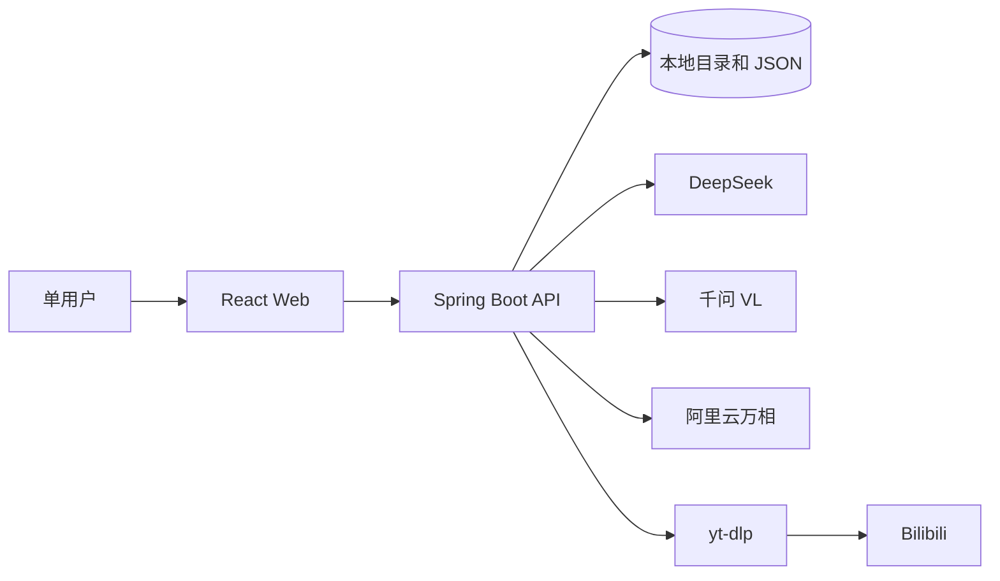
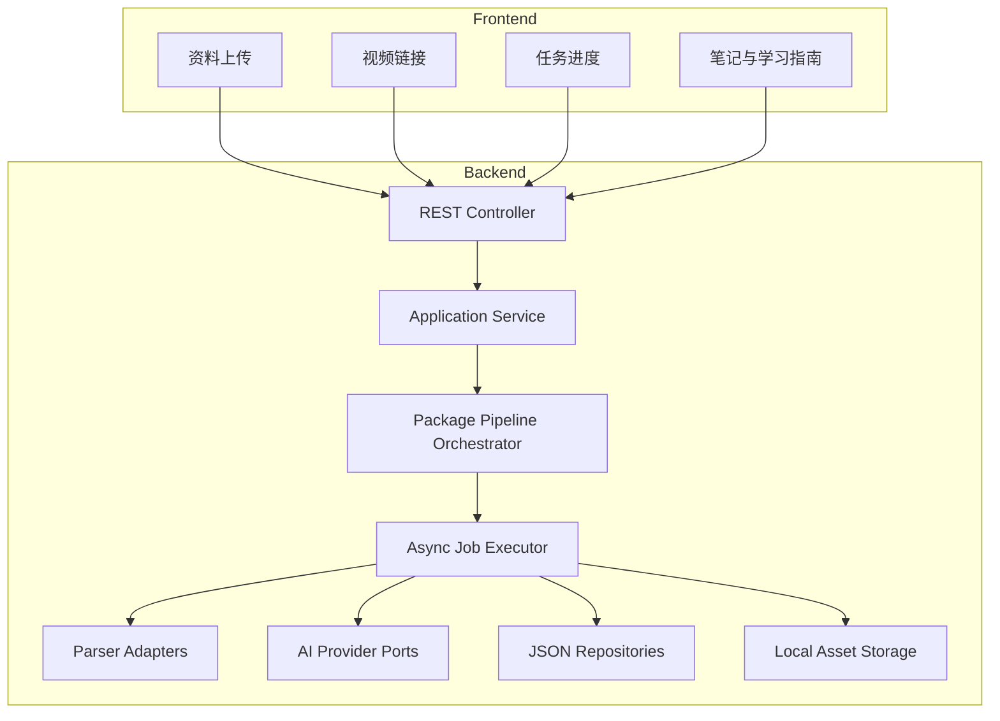
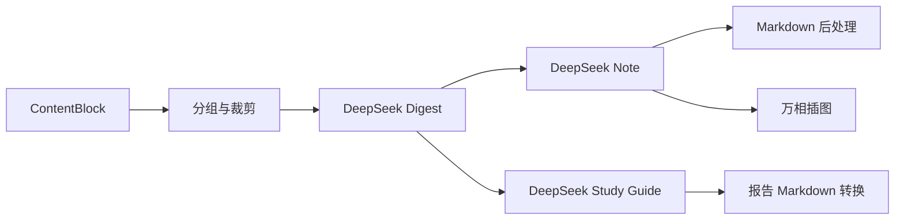

# AI 学习资料处理与智能复习系统方案设计文档

> 文档类型：技术方案设计文档<br>
> 产品代号：AI Sources Handler<br>
> 文档版本：V1.0<br>
> 文档状态：可实施<br>
> 创建日期：2026-06-07<br>
> 关联需求：[PRD.md](./PRD.md)<br>
> 目标读者：独立开发者、前端工程师、后端工程师、测试工程师、AI 应用工程师

---

## 目录

1. [方案概述](#1-方案概述)
2. [范围与边界](#2-范围与边界)
3. [设计原则](#3-设计原则)
4. [技术选型](#4-技术选型)
5. [总体架构](#5-总体架构)
6. [项目结构与模块边界](#6-项目结构与模块边界)
7. [核心领域模型](#7-核心领域模型)
8. [处理流水线与状态机](#8-处理流水线与状态机)
9. [不同资料类型的解析方案](#9-不同资料类型的解析方案)
10. [AI 编排设计](#10-ai-编排设计)
11. [本地存储设计](#11-本地存储设计)
12. [异步任务与并发设计](#12-异步任务与并发设计)
13. [API 设计](#13-api-设计)
14. [前端方案设计](#14-前端方案设计)
15. [配置设计](#15-配置设计)
16. [异常处理与降级](#16-异常处理与降级)
17. [安全设计](#17-安全设计)
18. [日志、监控与成本统计](#18-日志监控与成本统计)
19. [测试方案](#19-测试方案)
20. [开发流程与分阶段交付](#20-开发流程与分阶段交付)
21. [本地运行与交付方式](#21-本地运行与交付方式)
22. [后续演进设计](#22-后续演进设计)
23. [关键决策记录](#23-关键决策记录)
24. [参考资料](#24-参考资料)

---

## 1. 方案概述

### 1.1 建设目标

第一阶段建设一个可在 Windows 本机运行的单用户原型，优先跑通以下纵向业务闭环：

```text
资料包上传
→ 内容解析与标准化
→ AI 图文 Markdown 笔记
→ AI 资料学习指南
```

第一阶段应当能够处理：

- PDF 文件。
- TXT、Markdown 文件。
- 用户粘贴的纯文本。
- 单张或多张文档截图。
- PDF、文本和截图组成的混合资料包。
- 独立提交的 Bilibili 视频链接。

其中，PDF、文本、截图可在同一次提交中组成一个 `SourcePackage`，统一生成一篇笔记和一份学习指南。视频链接采用独立入口，每个链接形成一个独立资料包。

### 1.2 核心技术思路

方案采用“模块化单体 + 端口适配器”的结构：

- 使用 Spring Boot 提供 REST API、任务编排和文件处理。
- 使用 React 提供上传、任务进度和结果阅读界面。
- 使用本地目录和 JSON 持久化，暂不引入数据库。
- 使用进程内线程池执行异步任务，暂不引入消息队列。
- 使用统一领域接口隔离本地存储、DeepSeek、千问 VL、万相和 `yt-dlp`。
- 每个处理阶段保存独立 Job 状态，允许失败定位和阶段重试。
- AI 笔记、学习指南和 AI 插图分别生成，AI 插图失败不影响主流程成功。

### 1.3 方案结论

首阶段采用以下模型职责分工：

| 能力 | 服务 | 职责 |
|---|---|---|
| 文本理解与生成 | DeepSeek | 内容摘要、Markdown 笔记、结构化学习指南 |
| 图片理解 | 千问 VL | 截图和 PDF 页面图片的文字与知识内容识别 |
| AI 插图 | 阿里云万相 | 生成一张横向学习主题插图 |
| 视频字幕 | `yt-dlp` | 获取 Bilibili 元数据和已有字幕 |

DeepSeek 文本模型不直接接收图片。截图和扫描页必须先经过千问 VL 转换为可引用的结构化文本，再参与 DeepSeek 的笔记生成。

---

## 2. 范围与边界

### 2.1 第一阶段实现范围

| 模块 | 第一阶段能力 |
|---|---|
| 资料接入 | 混合文件上传、粘贴文本、B 站链接 |
| 资料解析 | PDF 文本、PDF 页面渲染、文本分段、图片视觉理解、字幕解析 |
| 内容标准化 | 统一生成带来源定位的 `ContentBlock` |
| AI 笔记 | 一篇可渲染的图文 Markdown 笔记 |
| AI 学习指南 | JSON 和 Markdown 两种形式 |
| AI 插图 | 默认生成一张，可关闭，可单独重试 |
| 任务系统 | 异步执行、进度查询、失败原因、阶段重试 |
| 存储 | 本地目录和 JSON |
| 前端 | 上传、任务进度、笔记、报告、资源预览 |
| 运维 | 健康检查、配置检查、结构化日志 |

### 2.2 第一阶段明确不实现

- 用户注册、登录和多用户权限。
- MySQL、Redis、RabbitMQ、Kafka。
- 对象存储。
- RAG、Embedding、向量数据库和资料问答。
- 学习行为追踪和掌握度计算。
- 按天排期的学习计划。
- 复习任务日历和消息提醒。
- Word 文件解析。
- 视频音频下载和 ASR。
- 通用视频网站适配。
- 在线协作和公开分享。
- 笔记在线编辑与版本历史。

### 2.3 首阶段业务约束

| 约束 | 默认值 |
|---|---|
| 单资料包文件数量 | 最多 20 个 |
| 单资料包文件总大小 | 最多 100 MB |
| 单张图片 | 最多 10 MB |
| 单个文本文件 | 最多 2 MB |
| 单个 PDF | 最多 300 页 |
| PDF 视觉分析页数 | 默认最多 12 页 |
| AI 插图数量 | 默认 1 张 |
| 视频链接数量 | 每个视频资料包 1 个 |
| 支持的视频平台 | Bilibili |
| 视频内容来源 | 已有字幕，不下载音视频 |

### 2.4 与 PRD 的阶段性差异

本方案是 PRD 的第一阶段实施子集，以下差异为已确认的阶段性取舍：

- PRD 中的“图片 OCR”在 MVP 中由千问 VL 文档视觉理解替代，不接入传统 OCR 引擎。
- PRD 中的“学习计划、学习任务和复习任务”暂不实现，先输出不落任务表的资料学习指南。
- PRD 中的“用户与权限、MySQL”暂不实现，使用固定本地用户和本地 JSON。
- PRD 中的视频转写降级暂不实现，无可用字幕时直接失败。
- PRD 中的笔记编辑、版本历史和导出增强能力留到核心生成链路稳定后。

这些取舍不改变后续产品方向，领域接口和数据结构需为后续能力保留迁移空间。

---

## 3. 设计原则

### 3.1 核心流程优先

先实现最短可运行链路，避免首阶段被账号、数据库、复杂部署和运维系统拖慢。

### 3.2 来源可追溯

每个用于生成笔记的内容块必须包含来源定位：

- PDF：文件 ID 和页码。
- 文本：文件 ID 和段落序号。
- 截图：资源 ID。
- 视频：字幕开始时间和结束时间。

模型不得自行构造页码、时间点或来源 ID。

### 3.3 原始数据与派生数据分离

以下数据必须分别保存：

- 原始上传文件。
- 原始字幕。
- 解析后的内容块。
- 图片理解结果。
- AI 摘要。
- Markdown 笔记。
- 学习指南。
- AI 插图。

重新执行后续阶段时，不覆盖原始输入。

### 3.4 异步任务可观察

耗时操作不占用 HTTP 请求线程等待完成。创建接口返回 `202 Accepted`，前端根据 Job 状态轮询。

### 3.5 外部能力可替换

业务层只依赖以下端口，不直接依赖具体厂商：

- `TextGenerationPort`
- `VisionUnderstandingPort`
- `ImageGenerationPort`
- `VideoSubtitlePort`
- `PackageRepository`
- `JobRepository`
- `AssetStorage`

### 3.6 允许局部成功

以下情况不应导致整个资料包失败：

- 某张装饰图片识别失败。
- PDF 某页图片提取失败，但文本可用。
- 万相 AI 插图失败。
- 学习指南 Markdown 转换失败，但 JSON 已生成。

局部失败必须被记录并展示。

---

## 4. 技术选型

### 4.1 后端选型

| 技术 | 基线版本 | 用途 | 选择理由 |
|---|---:|---|---|
| Java | 21 LTS | 后端运行时 | 长期支持，满足现代 Spring Boot 要求 |
| Spring Boot | 3.5.9 | Web、配置、任务、Actuator | 稳定的 3.x 系列，避免首版直接采用 Boot 4 |
| Spring MVC | 随 Boot 管理 | REST 与文件上传 | 与阻塞式文件、外部 CLI 和本地 I/O 更匹配 |
| Bean Validation | 随 Boot 管理 | 请求参数校验 | 统一声明式校验 |
| Jackson | 随 Boot 管理 | JSON 序列化 | 本地 JSON 和外部 API 统一使用 |
| Spring Actuator | 随 Boot 管理 | 健康检查 | 提供 `/actuator/health` |
| Apache PDFBox | 3.0.7 | PDF 文本、页面渲染、图片处理 | Java 原生、可按页处理 |
| Maven Wrapper | Maven 3.9.x | 构建 | 避免依赖机器全局 Maven |
| JUnit 5 | 随 Boot 管理 | 后端测试 | Spring Boot 默认测试体系 |
| WireMock | 测试依赖 | 外部模型接口模拟 | 验证超时、限流和非法响应 |

不使用 WebFlux。当前任务以文件系统、PDFBox、`ProcessBuilder` 和普通 HTTP 调用为主，使用 Spring MVC 与虚拟线程或有界线程池更容易控制。

### 4.2 前端选型

| 技术 | 基线版本 | 用途 | 选择理由 |
|---|---:|---|---|
| Node.js | 24.x | 前端构建运行时 | 与当前开发机一致，满足 Vite 8 要求 |
| React | 19.2.x | UI 框架 | 组件生态成熟 |
| TypeScript | 6.0.x | 类型系统 | API DTO 和页面状态类型化 |
| Vite | 8.0.x | 开发与构建 | 本地启动快，代理配置简单 |
| Ant Design | 6.4.x | UI 组件 | Upload、Steps、Progress、Tabs 等适合业务后台 |
| TanStack Query | 5.101.x | 服务端状态 | 上传 mutation、轮询、缓存失效 |
| React Router | 7.x | 页面路由 | 资料包详情和结果页导航 |
| React Markdown | 10.1.x | Markdown 渲染 | 渲染 AI 笔记和学习指南 |
| Mermaid | 11.15.x | 图形渲染 | 支持笔记中的 Mermaid |
| Vitest | 4.1.x | 单元测试 | 与 Vite 集成 |
| Playwright | 1.60.x | E2E 测试 | 验证核心纵向流程 |

前端不引入 Redux。服务端状态由 TanStack Query 管理，上传表单和局部 UI 状态由 React 与 Ant Design Form 管理。

### 4.3 外部服务选型

#### DeepSeek

- 默认地址：`https://api.deepseek.com`
- 调用路径：`/chat/completions`
- 默认模型别名：`deepseek-chat`
- 响应模式：`response_format={"type":"json_object"}`
- 用途：摘要、笔记、学习指南。

DeepSeek JSON Output 仍可能出现空内容或截断，因此必须执行空值检查、JSON 反序列化和一次重试。

#### 千问 VL

- 通过阿里云百炼兼容接口调用。
- 请求使用多模态消息，将图片编码为 Data URL。
- 每张用户截图单独处理。
- PDF 视觉页可分批处理，单次不超过 4 张。
- 模型名称通过 `QWEN_VL_MODEL` 配置。

#### 阿里云万相

- 通过 DashScope 万相接口调用。
- 从已生成笔记的高层摘要构建绘图 Prompt。
- 返回图片 URL 后立即下载到本地。
- 不在 Markdown 中保留外部临时 URL。

#### `yt-dlp`

- 作为外部可执行文件运行。
- 仅获取 Bilibili 元数据和已有字幕。
- 不下载视频和音频。
- 可选使用浏览器 Cookie。
- 执行超时默认 120 秒。

---

## 5. 总体架构

### 5.1 系统上下文



### 5.2 逻辑组件



### 5.3 分层职责

| 层 | 职责 | 禁止事项 |
|---|---|---|
| API | HTTP DTO、参数校验、状态码 | 不直接读写文件 |
| Application | 用例、事务边界、任务创建 | 不拼接厂商请求 JSON |
| Domain | 实体、枚举、状态转换、规则 | 不依赖 Spring |
| Infrastructure | 文件系统、JSON、PDFBox、HTTP、CLI | 不决定业务流程 |
| Frontend | 表单、状态轮询、结果展示 | 不推断后端任务状态 |

---

## 6. 项目结构与模块边界

### 6.1 仓库结构

```text
ai-sources-handler/
├── backend/
│   ├── .mvn/
│   ├── mvnw
│   ├── mvnw.cmd
│   ├── pom.xml
│   └── src/
│       ├── main/
│       │   ├── java/com/aisourceshandler/
│       │   └── resources/
│       └── test/
├── frontend/
│   ├── package.json
│   ├── vite.config.ts
│   ├── tsconfig.json
│   └── src/
├── docs/
│   ├── PRD.md
│   └── SOLUTION_DESIGN.md
├── runtime-data/
├── .env.example
├── .gitignore
└── README.md
```

`runtime-data/` 必须加入 `.gitignore`。

### 6.2 后端包结构

```text
com.aisourceshandler
├── api
│   ├── packageapi
│   ├── job
│   ├── asset
│   └── error
├── application
│   ├── packageflow
│   ├── job
│   └── query
├── domain
│   ├── source
│   ├── content
│   ├── job
│   ├── note
│   └── report
├── infrastructure
│   ├── persistence
│   ├── storage
│   ├── pdf
│   ├── text
│   ├── video
│   └── ai
└── config
```

Spring 资源目录：

```text
src/main/resources/
├── application.yml
└── prompts/
    ├── v1/digest-system.txt
    ├── v1/note-system.txt
    ├── v1/report-system.txt
    ├── v1/vision-system.txt
    └── v1/illustration-system.txt
```

Prompt 作为版本化资源管理，不将长 Prompt 直接硬编码在 Java 类中。每个 AI 输出元数据记录 Prompt 版本。

### 6.3 后端关键接口

```java
public interface PackageRepository {
    SourcePackage save(SourcePackage sourcePackage);
    Optional<SourcePackage> findById(UUID packageId);
    List<SourcePackage> findAll();
}

public interface JobRepository {
    ProcessingJob save(ProcessingJob job);
    Optional<ProcessingJob> findById(UUID jobId);
    List<ProcessingJob> findByPackageId(UUID packageId);
    List<ProcessingJob> findNonTerminalJobs();
}

public interface AssetStorage {
    StoredAsset storeOriginal(UUID packageId, UploadedAsset source);
    StoredAsset storeExtracted(UUID packageId, GeneratedAsset source);
    Path resolve(UUID packageId, UUID assetId);
}

public interface TextGenerationPort {
    DigestResult createDigest(DigestRequest request);
    NoteGenerationResult createNote(NoteGenerationRequest request);
    StudyGuide createStudyGuide(StudyGuideRequest request);
}

public interface VisionUnderstandingPort {
    VisionDocumentResult analyze(VisionDocumentRequest request);
}

public interface ImageGenerationPort {
    GeneratedImage generate(GenerateImageRequest request);
}

public interface VideoSubtitlePort {
    VideoSourceResult extract(VideoSourceRequest request);
}
```

### 6.4 前端结构

```text
src/
├── app/
│   ├── router.tsx
│   ├── query-client.ts
│   └── App.tsx
├── api/
│   ├── client.ts
│   ├── packages.ts
│   └── jobs.ts
├── features/
│   ├── package-create/
│   ├── video-create/
│   ├── package-progress/
│   └── package-result/
├── components/
│   ├── MarkdownViewer.tsx
│   ├── SourceCitation.tsx
│   ├── AssetImage.tsx
│   └── JobTimeline.tsx
├── types/
└── styles/
```

---

## 7. 核心领域模型

### 7.1 SourcePackage

`SourcePackage` 是一次资料处理的聚合根。

```json
{
  "schemaVersion": 1,
  "id": "97f26c8e-1128-4bb6-a919-34a43e9ddbc3",
  "title": "Java 并发与线程池学习资料",
  "packageType": "MIXED",
  "status": "PROCESSING",
  "currentStage": "VISION",
  "options": {
    "outputLanguage": "ZH_CN",
    "noteStyle": "INTERVIEW",
    "generateIllustration": true
  },
  "sourceItemIds": [],
  "createdAt": "2026-06-07T10:00:00+08:00",
  "updatedAt": "2026-06-07T10:01:30+08:00"
}
```

#### PackageType

- `MIXED`
- `VIDEO`

#### PackageStatus

- `QUEUED`
- `PROCESSING`
- `READY`
- `PARTIALLY_READY`
- `FAILED`
- `INTERRUPTED`

`PARTIALLY_READY` 表示笔记和学习指南已成功，但插图或非必要资源失败。

### 7.2 SourceItem

一个资料包包含一个或多个 `SourceItem`。

| 字段 | 类型 | 说明 |
|---|---|---|
| `id` | UUID | 素材 ID |
| `packageId` | UUID | 所属资料包 |
| `kind` | Enum | PDF、TEXT_FILE、PASTED_TEXT、IMAGE、VIDEO |
| `originalName` | String | 原始文件名 |
| `assetId` | UUID | 原文件资源 ID |
| `sequence` | Integer | 用户提交顺序 |
| `metadata` | Object | 页数、大小、视频信息等 |

### 7.3 ContentBlock

```json
{
  "id": "blk_01J...",
  "packageId": "97f26c8e-1128-4bb6-a919-34a43e9ddbc3",
  "sourceItemId": "d04812b0-...",
  "type": "TEXT",
  "sequence": 12,
  "content": "线程池通过复用工作线程降低线程创建成本。",
  "sourceRef": {
    "kind": "PDF_PAGE",
    "pageNumber": 18,
    "paragraphNumber": null,
    "assetId": null,
    "startTimeMs": null,
    "endTimeMs": null
  },
  "confidence": 1.0,
  "metadata": {
    "headingPath": ["线程池", "核心参数"]
  }
}
```

#### BlockType

- `HEADING`
- `TEXT`
- `CODE`
- `TABLE_TEXT`
- `IMAGE`
- `VISION_TEXT`
- `TRANSCRIPT`

#### SourceRefKind

- `PDF_PAGE`
- `TEXT_PARAGRAPH`
- `IMAGE_ASSET`
- `VIDEO_TIME_RANGE`
- `AI_SUPPLEMENT`

`AI_SUPPLEMENT` 仅用于明确标记的模型补充内容。

### 7.4 ProcessingJob

| 字段 | 说明 |
|---|---|
| `id` | Job ID |
| `packageId` | 资料包 ID |
| `stage` | 流水线阶段 |
| `status` | Job 状态 |
| `attempt` | 当前尝试次数 |
| `progress` | 0-100 |
| `errorCode` | 失败错误码 |
| `errorMessage` | 用户可读摘要 |
| `retryable` | 是否允许重试 |
| `inputFingerprint` | 输入指纹 |
| `startedAt` | 开始时间 |
| `finishedAt` | 结束时间 |
| `metrics` | 耗时、Token、调用次数 |

#### JobStatus

- `QUEUED`
- `RUNNING`
- `SUCCEEDED`
- `FAILED`
- `SKIPPED`
- `INTERRUPTED`

### 7.5 NoteOutput

笔记正文保存为 Markdown，元数据保存为 JSON：

```json
{
  "schemaVersion": 1,
  "title": "Java 线程池学习笔记",
  "markdownFile": "outputs/note.md",
  "citationCount": 26,
  "sourceImageAssetIds": [],
  "illustrationAssetId": null,
  "model": "deepseek-chat",
  "promptVersion": "note-v1",
  "generatedAt": "2026-06-07T10:10:00+08:00"
}
```

### 7.6 StudyGuide

学习指南固定字段如下：

```json
{
  "schemaVersion": 1,
  "overview": "资料覆盖 Java 线程池核心参数、执行流程和拒绝策略。",
  "targetAudience": ["Java 后端面试者", "并发编程初学者"],
  "difficulty": "INTERMEDIATE",
  "estimatedMinutes": 180,
  "prerequisites": ["Java 线程基础", "Runnable 与 Callable"],
  "learningObjectives": [],
  "recommendedSequence": [],
  "coreKnowledgePoints": [],
  "keyPoints": [],
  "difficultPoints": [],
  "commonMistakes": [],
  "interviewFocus": [],
  "exercises": [],
  "reviewSchedule": [
    {"afterDays": 1, "focus": "核心参数"},
    {"afterDays": 3, "focus": "执行流程"},
    {"afterDays": 7, "focus": "拒绝策略"},
    {"afterDays": 14, "focus": "面试表达"},
    {"afterDays": 30, "focus": "综合回顾"}
  ],
  "completenessWarnings": [],
  "aiRiskWarnings": []
}
```

---

## 8. 处理流水线与状态机

### 8.1 固定阶段

```text
INGEST
→ PARSE
→ VISION
→ DIGEST
→ NOTE
→ REPORT
→ ILLUSTRATION
```

### 8.2 状态流转

```mermaid
stateDiagram-v2
    [*] --> QUEUED
    QUEUED --> INGEST
    INGEST --> PARSE
    PARSE --> VISION
    VISION --> DIGEST
    DIGEST --> NOTE
    NOTE --> REPORT
    REPORT --> READY
    REPORT --> ILLUSTRATION: generateIllustration=true
    ILLUSTRATION --> READY: 成功
    ILLUSTRATION --> PARTIALLY_READY: 失败

    INGEST --> FAILED
    PARSE --> FAILED
    VISION --> FAILED
    DIGEST --> FAILED
    NOTE --> FAILED
    REPORT --> FAILED

    FAILED --> QUEUED: 重试失败阶段
```

### 8.3 各阶段输入输出

| 阶段 | 输入 | 输出 | 可跳过条件 |
|---|---|---|---|
| INGEST | Multipart 或视频 URL | 原始资源、SourceItem | 不可跳过 |
| PARSE | 原始文件或字幕 | 初始 ContentBlock、提取图片 | 不可跳过 |
| VISION | 用户图片、扫描页、选中 PDF 页 | VISION_TEXT ContentBlock | 没有待识别图片 |
| DIGEST | 全部 ContentBlock | 分组摘要和引用映射 | 不可跳过 |
| NOTE | Digest | `note.md`、note metadata | 不可跳过 |
| REPORT | Digest、Note | `report.json`、`report.md` | 不可跳过 |
| ILLUSTRATION | 笔记摘要 | `illustration.png` | 用户关闭 |

### 8.4 阶段重试规则

- 重试从失败阶段开始，不重复执行已成功阶段。
- 重试前检查上游输出文件是否存在且可解析。
- 输入指纹未变化时复用上游输出。
- 用户重新上传或改变生成参数时创建新资料包，不覆盖旧资料包。
- `ILLUSTRATION` 可独立重试。
- 非可重试错误返回 `retryable=false`。

### 8.5 服务重启恢复

应用启动时：

1. 查询所有非终态 Job。
2. 将 `RUNNING` 和 `QUEUED` 统一标记为 `INTERRUPTED`。
3. 将资料包状态更新为 `INTERRUPTED`。
4. 前端展示“服务中断，可重试”。
5. 不自动续跑，避免重复调用付费 API。

---

## 9. 不同资料类型的解析方案

### 9.1 上传统一校验

后端执行以下校验：

1. 文件数量不超过 20。
2. 总大小不超过 100 MB。
3. 扩展名与 MIME 类型一致。
4. 文件签名符合预期。
5. 文件名仅作为展示信息，不参与真实路径生成。
6. 空文件拒绝。
7. 同一请求至少包含一个文件或非空粘贴文本。

支持格式：

- PDF：`.pdf`
- 文本：`.txt`、`.md`
- 图片：`.png`、`.jpg`、`.jpeg`、`.webp`

### 9.2 纯文本

处理步骤：

1. 按 UTF-8 解码。
2. 移除 BOM。
3. 统一换行为 `\n`。
4. 连续空行压缩到最多两个。
5. 按 Markdown 标题或空行拆分段落。
6. 每个段落生成一个 `TEXT` 或 `HEADING` 内容块。
7. 保存段落序号。

单个内容块建议控制在 4,000 字符以内。超长段落按句子边界继续拆分。

### 9.3 PDF

#### 9.3.1 文本提取

使用 PDFBox：

- 打开文档前检查是否加密。
- 加密且无法空密码打开时返回 `PDF_ENCRYPTED`。
- 页数超过 300 返回 `PDF_PAGE_LIMIT_EXCEEDED`。
- 使用页级文本提取，不将整本 PDF 一次读入一个字符串。
- 每页保留页码并进行段落拆分。

#### 9.3.2 扫描页识别

每页计算有效文本字符数：

- 大于等于 80：视为文本页。
- 小于 80：视为候选扫描页。

候选扫描页使用 PDFBox 以 144 DPI 渲染为 JPEG，再交给千问 VL。

#### 9.3.3 视觉页选择

最多选择 12 页进入视觉理解，优先级如下：

1. 文本字符数小于 80 的页面。
2. 包含大面积图片的页面。
3. 首页或目录页。
4. 按文档位置均匀抽样的页面。

如果候选页超过 12 页：

- 先保留前 4 个扫描页。
- 再保留图片面积最高的 4 页。
- 最后从剩余页面均匀抽样 4 页。

#### 9.3.4 图片提取

MVP 不追求提取 PDF 中所有内部图片对象。采用两类资源：

- 重要页面渲染图。
- 可稳定提取且面积超过页面 15% 的图片。

图片去重使用 SHA-256。

### 9.4 截图图片

每张图片：

1. 保存原图。
2. 校验尺寸和文件大小。
3. 根据 EXIF 自动旋转。
4. 长边超过 2,048 像素时生成分析副本，原图不变。
5. 单独调用千问 VL。
6. 将视觉结果保存为 `VISION_TEXT`。
7. `sourceRef.assetId` 指向原图。

千问 VL 输出结构：

```json
{
  "title": "线程池执行流程图",
  "documentType": "SLIDE",
  "visibleText": "完整可辨识文本",
  "knowledgePoints": [],
  "codeBlocks": [],
  "uncertainItems": [],
  "confidence": 0.92
}
```

### 9.5 Bilibili 视频

#### 9.5.1 URL 校验

只接受：

- `bilibili.com`
- `www.bilibili.com`
- `b23.tv`

重定向后的最终 URL 仍需校验属于允许域名。

#### 9.5.2 元数据与字幕命令

元数据：

```powershell
yt-dlp --skip-download --dump-single-json --no-playlist "<url>"
```

字幕：

```powershell
yt-dlp `
  --skip-download `
  --write-subs `
  --write-auto-subs `
  --sub-langs "zh-Hans,zh-Hant,zh,en" `
  --sub-format "vtt/srt/best" `
  --output "<package-dir>/inputs/video/%(id)s.%(ext)s" `
  "<url>"
```

可选参数：

```powershell
--cookies-from-browser chrome
```

#### 9.5.3 字幕处理

- 优先顺序：简体中文、繁体中文、中文、英文。
- 支持 VTT 和 SRT。
- 合并重复字幕行。
- 保留起止时间。
- 每 30-90 秒合并为一个 `TRANSCRIPT` 内容块。
- 没有字幕时返回 `VIDEO_SUBTITLE_UNAVAILABLE`，`retryable=false`。

---

## 10. AI 编排设计

### 10.1 AI 处理流程



### 10.2 内容分组

内容块按以下顺序分组：

1. 优先按 PDF 标题层级。
2. 无标题时按来源文件。
3. 视频按时间段。
4. 截图按用户提交顺序。

单个 Digest 输入组默认上限：

- 约 20,000 个 Unicode 字符。
- 最多 80 个内容块。
- 不拆分代码块。

超过上限时按内容块边界分组。

### 10.3 引用协议

传给 DeepSeek 的每个内容块使用稳定引用键：

```text
[BLOCK:blk_01JABC]
SOURCE: PDF_PAGE file=java-concurrency.pdf page=18
CONTENT:
线程池通过复用工作线程降低线程创建成本。
```

模型输出中的引用格式固定为：

```text
[[cite:blk_01JABC]]
```

后处理规则：

- 引用键必须存在于当前资料包。
- 不存在的引用删除并记录警告。
- Markdown 展示时转换为内部链接。
- 引用点击后打开来源资源和定位信息。
- 无来源的 AI 补充使用 `[[ai-supplement]]` 标记。

### 10.4 Digest 生成

Digest 是笔记和学习指南的共同中间产物：

```json
{
  "sectionTitle": "线程池核心参数",
  "summary": "...",
  "knowledgePoints": [
    {
      "text": "...",
      "citationKeys": ["blk_01JABC"]
    }
  ],
  "codeExamples": [],
  "interviewQuestions": [],
  "warnings": []
}
```

每组内容单独生成 Digest，随后由本地代码合并。合并阶段不让模型改写引用键。

### 10.5 DeepSeek 请求规范

请求参数：

```json
{
  "model": "${DEEPSEEK_MODEL}",
  "temperature": 0.2,
  "response_format": {"type": "json_object"},
  "max_tokens": 8192,
  "messages": [
    {"role": "system", "content": "版本化系统提示词"},
    {"role": "user", "content": "资料和明确 JSON 示例"}
  ]
}
```

规则：

- System Prompt 必须包含 JSON 示例。
- DTO 反序列化后执行 Bean Validation。
- 响应为空、非法 JSON 或必填字段缺失时，修改提示词后重试一次。
- HTTP 429、502、503、504 可重试。
- 其他 4xx 默认不可重试。
- 每次调用保存模型、Prompt 版本、耗时、输入输出 Token。

### 10.6 笔记生成

默认笔记结构：

```markdown
# 标题

> 资料范围与生成说明

## 核心摘要
## 知识结构
## 重点概念
## 原理与实现
## 代码或示例
## 面试高频问题
## 易错点与对比
## 学习建议
## 来源索引
```

笔记生成约束：

- 重要知识点必须带引用。
- 原资料图片使用 `asset://{assetId}`。
- 笔记中使用不可见标记 `<!-- asset-slot:illustration -->` 指定 AI 插图位置。
- 不使用外部临时图片 URL。
- AI 补充段落添加“AI 补充”提示。

AI 插图完成后只更新 `note.json` 中的 `illustrationAssetId`。前端在标记位置注入图片；图片不存在时移除标记，不修改模型生成的正文。导出功能后续再将标记物化为相对图片路径。

### 10.7 学习指南生成

DeepSeek 输出 `StudyGuide` JSON。后端负责：

1. JSON 校验。
2. 难度枚举标准化。
3. 学习时长边界修正为 15-2,400 分钟。
4. 确保复习间隔包含 1、3、7、14、30 天。
5. 使用本地模板生成 `report.md`。

学习指南 Markdown 不由模型直接生成，避免 JSON 与 Markdown 内容不一致。

### 10.8 千问 VL 调用

每次请求包含：

- 一张截图，或最多四张连续 PDF 页面。
- 明确的文档分析 Prompt。
- Data URL 图片。
- 要求输出 JSON。

如果多张 PDF 页面结果无法解析，则降级为逐页调用。

视觉识别失败处理：

- 用户截图失败：`VISION` 阶段失败，可重试。
- PDF 非关键图片失败：记录警告并继续。
- 扫描 PDF 所有候选页均失败：`VISION` 阶段失败。

### 10.9 万相插图

插图 Prompt 只使用以下信息：

- 笔记标题。
- 核心摘要。
- 最多 8 个一级知识点。
- 明确的教育信息图风格要求。

不直接发送整份原始资料，减少成本和内容审核误判。

生成流程：

1. 创建 `ILLUSTRATION` Job。
2. 调用万相。
3. 获取临时图片 URL。
4. 在 URL 有效期内下载。
5. 校验 Content-Type 和非空字节。
6. 保存为 `outputs/illustration.png`。
7. 更新 note metadata。

失败时：

- 资料包状态为 `PARTIALLY_READY`。
- `note.md` 和报告保持可访问。
- 前端展示“AI 插图生成失败，可重试”。

---

## 11. 本地存储设计

### 11.1 目录结构

```text
runtime-data/packages/{packageId}/
├── package.json
├── source-items.json
├── inputs/
│   ├── files/
│   ├── pasted-text.txt
│   └── video/
├── assets/
│   ├── original/
│   ├── extracted/
│   └── index.json
├── normalized/
│   ├── content-blocks.json
│   ├── vision-results.json
│   └── digests.json
├── jobs/
│   └── {jobId}.json
└── outputs/
    ├── note.json
    ├── note.md
    ├── report.json
    ├── report.md
    └── illustration.png
```

### 11.2 路径安全

- `packageId`、`jobId`、`assetId` 由服务端生成 UUID。
- 实际文件名使用 UUID 加受信任扩展名。
- 原始文件名只保存在 JSON 元数据。
- 所有解析后的路径必须 `normalize()`。
- 最终路径必须仍位于配置的 `runtime-data` 根目录下。
- 下载接口不接受任意相对路径。

### 11.3 JSON Schema 版本

所有顶级 JSON 文件必须包含：

```json
{
  "schemaVersion": 1
}
```

读取时：

- 不支持的高版本返回 `STORAGE_SCHEMA_UNSUPPORTED`。
- 低版本通过迁移器升级。
- 第一阶段只实现 `v1 -> v1`，但保留迁移接口。

### 11.4 原子写入

写入流程：

1. 在同一目录创建 `{file}.tmp-{uuid}`。
2. 写入 UTF-8 JSON。
3. 执行 `fsync` 或关闭流。
4. 使用 `ATOMIC_MOVE` 替换目标文件。
5. 文件系统不支持原子移动时退化为 `REPLACE_EXISTING`。

### 11.5 包级锁

- 使用 `ConcurrentHashMap<UUID, ReentrantLock>`。
- 所有包状态和输出元数据修改必须持有包级锁。
- 外部 API 调用期间不持有锁。
- 调用前读取快照，调用后重新加锁并校验 Job 仍处于预期状态。

### 11.6 Repository 迁移准备

领域层不出现：

- `Path`
- `MultipartFile`
- Jackson `JsonNode`
- JPA 注解

后续迁移 MySQL 时新增 JPA Adapter，不改变 Application Service 和领域对象。

---

## 12. 异步任务与并发设计

### 12.1 线程池

默认配置：

```yaml
app:
  jobs:
    core-pool-size: 2
    max-pool-size: 4
    queue-capacity: 32
    keep-alive-seconds: 60
```

线程名：`source-job-`。

拒绝策略：创建请求返回 `JOB_QUEUE_FULL`，HTTP 503，不在请求线程执行。

### 12.2 并发限制

| 外部能力 | 最大并发 |
|---|---:|
| DeepSeek | 2 |
| 千问 VL | 2 |
| 万相 | 1 |
| `yt-dlp` | 1 |

使用 `Semaphore` 控制，等待超过 30 秒返回可重试错误。

### 12.3 包内执行规则

- 同一个资料包的阶段严格串行。
- `VISION` 阶段可以对不同截图并发，最大 2。
- `DIGEST` 可以对不同分组并发，最大 2。
- `NOTE` 和 `REPORT` 在 Digest 完成后顺序执行。
- `ILLUSTRATION` 在报告完成后异步执行。

### 12.4 幂等性

- 每个阶段根据上游文件内容和生成配置计算 SHA-256 指纹。
- 相同阶段、相同指纹已有成功 Job 时直接复用。
- 重试创建新的 Job 记录，旧 Job 不覆盖。
- 前端重复点击提交时使用 `Idempotency-Key`。
- 相同幂等键在 10 分钟内返回原创建结果。
- 第一阶段使用有界内存缓存保存幂等键，最多 1,000 条；服务重启后缓存失效。
- 后续迁移数据库时将幂等记录持久化。

### 12.5 进度计算

资料包总体进度权重：

| 阶段 | 权重 |
|---|---:|
| INGEST | 10% |
| PARSE | 20% |
| VISION | 20% |
| DIGEST | 15% |
| NOTE | 15% |
| REPORT | 15% |
| ILLUSTRATION | 5% |

跳过的阶段视为完成。

---

## 13. API 设计

### 13.1 通用约定

- Base Path：`/api/v1`
- 时间格式：ISO 8601，带时区。
- ID：UUID 字符串。
- JSON：UTF-8。
- 创建异步任务：HTTP 202。
- 资源未生成：HTTP 409。
- 请求追踪：响应头 `X-Request-Id`。

### 13.2 创建混合资料包

```http
POST /api/v1/packages
Content-Type: multipart/form-data
Idempotency-Key: <uuid>
```

表单字段：

| 字段 | 类型 | 必填 | 说明 |
|---|---|---|---|
| `files` | File[] | 否 | PDF、TXT、MD、图片 |
| `textContent` | String | 否 | 粘贴文本 |
| `title` | String | 否 | 未提供时自动推导 |
| `outputLanguage` | Enum | 否 | 默认 `ZH_CN` |
| `noteStyle` | Enum | 否 | 默认 `INTERVIEW` |
| `generateIllustration` | Boolean | 否 | 默认 `true` |

`files` 和 `textContent` 至少一个非空。

响应：

```json
{
  "packageId": "97f26c8e-1128-4bb6-a919-34a43e9ddbc3",
  "rootJobId": "b9c9424d-6e38-43a7-b90d-2d315bb063ee",
  "status": "QUEUED",
  "statusUrl": "/api/v1/packages/97f26c8e-1128-4bb6-a919-34a43e9ddbc3"
}
```

### 13.3 创建视频资料包

```http
POST /api/v1/video-packages
Content-Type: application/json
```

```json
{
  "url": "https://www.bilibili.com/video/BV...",
  "title": null,
  "outputLanguage": "ZH_CN",
  "noteStyle": "INTERVIEW",
  "generateIllustration": true
}
```

响应与混合资料包一致。

### 13.4 查询资料包

```http
GET /api/v1/packages/{packageId}
```

```json
{
  "id": "...",
  "title": "...",
  "packageType": "MIXED",
  "status": "PROCESSING",
  "currentStage": "DIGEST",
  "progress": 58,
  "warnings": [],
  "outputs": {
    "noteReady": false,
    "reportReady": false,
    "illustrationReady": false
  }
}
```

### 13.5 查询资料包列表

```http
GET /api/v1/packages?limit=20&cursor=<optional>
```

按 `createdAt` 倒序返回，用于首页最近资料包。第一阶段使用基于 `createdAt + packageId` 的游标分页，不使用页码分页。

### 13.6 查询 Job

```http
GET /api/v1/packages/{packageId}/jobs
```

按阶段顺序返回全部尝试记录。

### 13.7 重试 Job

```http
POST /api/v1/jobs/{jobId}/retry
```

限制：

- 仅 `FAILED` 或 `INTERRUPTED` 可重试。
- `retryable=false` 返回 HTTP 409。
- 重试生成新 Job ID。

### 13.8 获取笔记

```http
GET /api/v1/packages/{packageId}/note
Accept: text/markdown
```

未生成时返回 HTTP 409 和 `NOTE_NOT_READY`。

### 13.9 获取学习指南

```http
GET /api/v1/packages/{packageId}/report
Accept: application/json
```

支持：

- `Accept: application/json`
- `Accept: text/markdown`

### 13.10 查询引用定位

```http
GET /api/v1/packages/{packageId}/citations/{blockId}
```

响应：

```json
{
  "blockId": "blk_01JABC",
  "sourceKind": "PDF_PAGE",
  "displayName": "java-concurrency.pdf 第 18 页",
  "assetUrl": "/api/v1/packages/{packageId}/assets/{assetId}",
  "pageNumber": 18,
  "paragraphNumber": null,
  "startTimeMs": null,
  "endTimeMs": null,
  "excerpt": "线程池通过复用工作线程降低线程创建成本。"
}
```

视频引用的 `assetUrl` 为原视频 URL，前端根据 `startTimeMs` 生成带时间参数的跳转链接。返回的 `excerpt` 最多 500 字符。

### 13.11 获取资源

```http
GET /api/v1/packages/{packageId}/assets/{assetId}
```

响应：

- 正确的 `Content-Type`。
- `Content-Disposition: inline`。
- 开发阶段可使用 `Cache-Control: private, max-age=3600`。

### 13.12 查询能力状态

```http
GET /api/v1/capabilities
```

返回 DeepSeek、千问 VL、万相和视频解析能力是否可用，不返回密钥或完整外部地址。

### 13.13 错误响应

```json
{
  "requestId": "req_01J...",
  "errorCode": "VIDEO_SUBTITLE_UNAVAILABLE",
  "message": "该视频没有可获取的字幕，MVP 不进行音频转写。",
  "retryable": false,
  "details": {}
}
```

---

## 14. 前端方案设计

### 14.1 页面路由

| 路由 | 页面 |
|---|---|
| `/` | 最近资料包与入口 |
| `/packages/new` | 混合资料上传 |
| `/videos/new` | B 站链接提交 |
| `/packages/:packageId` | 进度与结果详情 |

### 14.2 混合上传页

使用 Ant Design：

- `Upload.Dragger`
- `Form`
- `Input.TextArea`
- `Select`
- `Switch`
- `Alert`

Upload 使用受控 `fileList`：

- `beforeUpload={() => false}` 阻止自动上传。
- 用户点击“开始处理”时统一构造一个 `FormData`。
- 文件选择阶段完成扩展名、数量和单文件大小校验。
- 后端仍执行全部安全校验。

页面明确展示：

- 当前文件数量。
- 总大小。
- 支持格式。
- 是否生成 AI 插图。
- 图片会发送给千问 VL。
- 文本会发送给 DeepSeek。

### 14.3 视频页

字段：

- Bilibili URL。
- 可选标题。
- 笔记风格。
- 是否生成插图。

提交前仅进行 URL 格式提示，最终平台校验由后端完成。

### 14.4 任务进度

使用 `Steps` 展示固定阶段，使用 `Progress` 展示总体进度。

TanStack Query 策略：

```ts
useQuery({
  queryKey: ['package', packageId],
  queryFn: () => getPackage(packageId),
  refetchInterval: (query) => {
    const status = query.state.data?.status
    return ['READY', 'PARTIALLY_READY', 'FAILED'].includes(status ?? '')
      ? false
      : 1500
  },
  retry: 2,
})
```

规则：

- 创建 mutation 不自动重试，避免重复上传。
- GET 查询网络错误重试 2 次。
- 到达终态停止轮询。
- 页面重新打开时根据 URL 恢复查询。
- 任务重试成功后失效 `package` 和 `jobs` Query。

### 14.5 结果页

使用 `Tabs`：

1. `AI 笔记`
2. `学习指南`
3. `原始资料`
4. `处理记录`

AI 插图失败时使用非阻塞 `Alert`，不使用整页错误状态。

### 14.6 Markdown 渲染

Markdown 渲染链：

- `react-markdown`
- `remark-gfm`
- `rehype-sanitize`
- 自定义 `img` 和 `a` 渲染器

处理 `asset://`：

```text
asset://{assetId}
→ /api/v1/packages/{packageId}/assets/{assetId}
```

引用处理：

```text
[[cite:blockId]]
→ 可点击 SourceCitation 组件
```

AI 插图标记处理：

```text
<!-- asset-slot:illustration -->
→ illustrationAssetId 存在时渲染图片，否则不输出
```

禁止：

- 原始 HTML 默认执行。
- `javascript:` URL。
- 未经白名单的外部 iframe。

Mermaid 代码块在客户端渲染，渲染失败时显示原始代码。

### 14.7 前端状态边界

- TanStack Query：资料包、Job、笔记、报告。
- React State：当前 Tab、预览弹窗。
- Ant Design Form：上传表单。
- URL：当前资料包 ID。
- 不在 `localStorage` 保存 API 密钥。

---

## 15. 配置设计

### 15.1 后端配置

```yaml
server:
  port: 8080

spring:
  servlet:
    multipart:
      max-file-size: 100MB
      max-request-size: 110MB

management:
  endpoints:
    web:
      exposure:
        include: health,info

app:
  storage:
    root: ${APP_STORAGE_ROOT:../runtime-data}
  upload:
    max-files: 20
    max-total-bytes: 104857600
    max-image-bytes: 10485760
    max-text-bytes: 2097152
    max-pdf-pages: 300
  pdf:
    visual-page-limit: 12
    render-dpi: 144
  jobs:
    core-pool-size: 2
    max-pool-size: 4
    queue-capacity: 32
  video:
    yt-dlp-path: ${YT_DLP_PATH:yt-dlp}
    timeout-seconds: 120
    cookies-from-browser: ${YT_DLP_COOKIES_FROM_BROWSER:}
```

### 15.2 环境变量

| 环境变量 | 必填 | 说明 |
|---|---|---|
| `DEEPSEEK_API_KEY` | 是 | DeepSeek 密钥 |
| `DEEPSEEK_BASE_URL` | 否 | 默认 `https://api.deepseek.com` |
| `DEEPSEEK_MODEL` | 否 | 默认 `deepseek-chat` |
| `DASHSCOPE_API_KEY` | 是 | 千问 VL 与万相密钥 |
| `QWEN_VL_BASE_URL` | 否 | 百炼兼容接口 |
| `QWEN_VL_MODEL` | 是 | 千问 VL 模型 |
| `WANX_BASE_URL` | 否 | 万相接口根地址 |
| `WANX_MODEL` | 是 | 万相模型 |
| `APP_STORAGE_ROOT` | 否 | 本地数据目录 |
| `YT_DLP_PATH` | 否 | `yt-dlp` 可执行文件 |
| `YT_DLP_COOKIES_FROM_BROWSER` | 否 | 例如 `chrome` |

### 15.3 配置校验

启动时：

- DeepSeek 配置缺失：应用启动失败。
- 千问 VL 配置缺失：应用启动失败。
- 万相配置缺失：应用允许启动，但自动关闭插图功能并显示健康警告。
- `yt-dlp` 不存在：应用允许启动，视频能力标记为不可用。

提供：

```http
GET /api/v1/capabilities
```

返回各能力是否可用，但不暴露密钥。

---

## 16. 异常处理与降级

### 16.1 错误码

| 错误码 | 可重试 | 说明 |
|---|---|---|
| `UPLOAD_FILE_LIMIT_EXCEEDED` | 否 | 文件数量超限 |
| `UPLOAD_TOTAL_SIZE_EXCEEDED` | 否 | 总大小超限 |
| `UNSUPPORTED_FILE_TYPE` | 否 | 不支持的格式 |
| `PDF_ENCRYPTED` | 否 | PDF 无法打开 |
| `PDF_CORRUPTED` | 否 | PDF 损坏 |
| `PDF_PAGE_LIMIT_EXCEEDED` | 否 | 页数超限 |
| `VISION_RESPONSE_INVALID` | 是 | 千问 VL 响应非法 |
| `DEEPSEEK_RESPONSE_EMPTY` | 是 | DeepSeek 空响应 |
| `DEEPSEEK_JSON_INVALID` | 是 | DeepSeek JSON 非法 |
| `AI_RATE_LIMITED` | 是 | 外部服务限流 |
| `VIDEO_URL_UNSUPPORTED` | 否 | 非 B 站链接 |
| `VIDEO_SUBTITLE_UNAVAILABLE` | 否 | 无字幕 |
| `YT_DLP_NOT_AVAILABLE` | 是 | 工具缺失 |
| `IMAGE_GENERATION_FAILED` | 是 | 万相失败 |
| `JOB_QUEUE_FULL` | 是 | 本地任务队列已满 |
| `JOB_INTERRUPTED` | 是 | 服务重启中断 |
| `STORAGE_WRITE_FAILED` | 是 | 本地存储失败 |

### 16.2 HTTP 重试策略

外部服务：

- 429：等待 `Retry-After`，没有则 2 秒。
- 502、503、504：指数退避 1 秒、3 秒。
- 网络超时：重试一次。
- 非 429 的 4xx：不重试。

DeepSeek 内容校验失败允许额外一次“修复型重试”，不与 HTTP 重试累计。

### 16.3 降级矩阵

| 失败能力 | 降级结果 |
|---|---|
| PDF 某页图片提取 | 使用页面渲染图 |
| PDF 非关键视觉页 | 忽略该页视觉结果 |
| 用户截图视觉理解 | 主流程失败，允许重试 |
| DeepSeek Digest | 主流程失败 |
| DeepSeek Note | 报告不继续生成 |
| DeepSeek Report | 笔记保留，资料包失败，可重试报告 |
| 万相 | `PARTIALLY_READY` |
| B 站无字幕 | 视频资料包失败，不做 ASR |

---

## 17. 安全设计

### 17.1 文件安全

- 校验扩展名、MIME 和文件签名。
- 不执行上传文件。
- 不解压压缩包。
- PDFBox 解析配置内存和页数限制。
- 文件访问仅允许通过 `packageId + assetId`。
- 禁止用户输入真实文件系统路径。

### 17.2 SSRF 防护

视频 URL：

- 仅允许 HTTPS。
- 仅允许 Bilibili 白名单域名。
- 拒绝 IP 地址形式 URL。
- 拒绝 localhost 和内网地址。
- 重定向后再次校验域名。

万相返回的图片 URL：

- 只允许阿里云指定域名。
- 限制下载大小为 20 MB。
- 请求超时 30 秒。

### 17.3 Markdown 安全

- 使用 HTML Sanitizer。
- 不渲染任意脚本。
- 外部链接添加 `rel="noopener noreferrer"`。
- Mermaid 初始化使用严格安全级别。

### 17.4 密钥安全

- 密钥只从环境变量读取。
- `.env.local` 加入 `.gitignore`。
- 日志不打印 Authorization Header。
- `/api/v1/capabilities` 只返回布尔状态。

### 17.5 单用户边界

第一阶段没有账号，但仍保留以下未来兼容字段：

- `ownerId` 固定为 `local-user`。
- Repository 查询方法保留 owner 条件。
- API 不接受前端传入 `ownerId`。

---

## 18. 日志、监控与成本统计

### 18.1 日志字段

每条任务日志包含：

- `requestId`
- `packageId`
- `jobId`
- `stage`
- `provider`
- `attempt`
- `durationMs`
- `result`
- `errorCode`

不记录完整原文、完整 Prompt、图片 Base64 和 API 密钥。

### 18.2 Job Metrics

```json
{
  "durationMs": 4231,
  "provider": "deepseek",
  "model": "deepseek-chat",
  "inputTokens": 12000,
  "outputTokens": 2300,
  "estimatedCost": 0.0,
  "externalRequestCount": 2
}
```

成本单价不硬编码在业务逻辑中。通过配置文件维护模型价格，未知价格时仅记录 Token。

### 18.3 健康检查

Actuator：

- `diskSpace`
- 应用状态。

自定义能力检查：

- 存储目录可写。
- DeepSeek 配置存在。
- 千问 VL 配置存在。
- 万相配置状态。
- `yt-dlp --version` 可执行。

健康检查不主动调用付费模型。

---

## 19. 测试方案

### 19.1 后端单元测试

| 模块 | 测试重点 |
|---|---|
| File Validation | 类型、大小、数量、空文件 |
| Path Guard | 路径穿越和越界路径 |
| Text Parser | UTF-8、BOM、长段落 |
| PDF Parser | 文本页、扫描页、加密、损坏、页数 |
| Content Block | 顺序和来源定位 |
| State Machine | 合法与非法状态转换 |
| Citation Validator | 有效、无效和 AI 补充引用 |
| Study Guide Renderer | JSON 到 Markdown 一致性 |
| Atomic JSON Repository | 写入、替换和损坏恢复 |

### 19.2 后端集成测试

使用临时目录和 WireMock：

- DeepSeek 正常 JSON。
- DeepSeek 空内容后重试成功。
- DeepSeek 连续非法 JSON。
- DeepSeek 429 后成功。
- 千问 VL 正常结构。
- 千问 VL 单图失败。
- 万相返回临时 URL。
- 万相失败但主流程成功。
- `yt-dlp` 使用测试脚本模拟输出和退出码。

### 19.3 前端组件测试

- 受控上传列表添加和删除。
- 文件数量与大小提示。
- 创建 mutation 成功跳转。
- 轮询在终态停止。
- `PARTIALLY_READY` 展示非阻塞警告。
- Markdown `asset://` 转换。
- 引用点击定位。

### 19.4 Playwright 核心流程

1. 粘贴纯文本。
2. 提交资料包。
3. 查看阶段进度。
4. 等待任务完成。
5. 打开 Markdown 笔记。
6. 打开学习指南。

使用后端 Mock Profile，避免 E2E 调用真实付费模型。

### 19.5 人工验收资料

- 文本型 Java PDF。
- 扫描型 PDF。
- 代码截图。
- 架构图截图。
- TXT 与粘贴文本混合输入。
- PDF、文本和多截图混合资料包。
- 有字幕 B 站视频。
- 无字幕 B 站视频。
- 损坏 PDF。
- 加密 PDF。

### 19.6 核心验收标准

- 混合上传只生成一个资料包。
- 笔记和报告在服务重启后仍可读取。
- 所有引用都能映射到真实内容块。
- DeepSeek 不合法输出不会直接写入最终文件。
- 万相失败不阻塞主结果。
- 无字幕视频给出明确不可重试原因。
- 任何用户文件名都无法突破存储根目录。

---

## 20. 开发流程与分阶段交付

### 20.1 开发方式

每个阶段遵循：

```text
定义输入输出
→ 编写失败测试
→ 实现最小功能
→ 集成验证
→ 更新文档和示例
→ 进入下一阶段
```

每个阶段必须可单独演示，不在一个大分支中积累全部功能后一次性联调。

### 20.2 Phase 1：工程骨架与纯文本闭环

实现：

- Spring Boot 和 React 工程。
- 本地 JSON Repository。
- Job 状态机和线程池。
- 纯文本资料包。
- DeepSeek Digest、Note、StudyGuide。
- 进度页、笔记页、报告页。

验收门：

- 粘贴纯文本可以完整生成笔记和报告。
- 服务重启后结果存在。
- DeepSeek 非法 JSON 有重试和明确错误。

### 20.3 Phase 2：PDF 处理

实现：

- PDF 上传和校验。
- 按页文本提取。
- 内容块页码定位。
- 扫描页判定。
- PDF 页面渲染和视觉页选择。

验收门：

- 文本型 PDF 生成带页码引用的笔记。
- 加密、损坏、超页数 PDF 正确失败。

### 20.4 Phase 3：截图和混合资料包

实现：

- 多截图上传。
- 千问 VL 适配器。
- PDF 视觉页。
- PDF、文本、截图统一编排。
- 原图插入 Markdown。

验收门：

- 混合输入只形成一个资料包。
- 截图内容进入笔记。
- 图片引用可以打开原图。

### 20.5 Phase 4：Bilibili 视频

实现：

- URL 白名单。
- `yt-dlp` 能力检测。
- 元数据、字幕下载和解析。
- 时间范围引用。

验收门：

- 有字幕视频成功。
- 无字幕视频明确失败。
- 不产生视频或音频文件。

### 20.6 Phase 5：万相插图

实现：

- 独立 `ILLUSTRATION` Job。
- 万相 Provider。
- 临时 URL 下载。
- Markdown 占位符解析。
- 单独重试。

验收门：

- 成功时结果页显示插图。
- 失败时笔记和报告仍可访问。

### 20.7 Phase 6：质量加固

实现：

- 完整错误码。
- 成本与耗时统计。
- 安全校验。
- 后端集成测试。
- Playwright E2E。
- README 和 `.env.example`。

---

## 21. 本地运行与交付方式

### 21.1 开发环境

- Windows 11。
- Java 21。
- Node.js 24.x。
- Git。
- `yt-dlp`。
- 可选 Chrome Cookie。

Maven 由 Wrapper 提供。

### 21.2 后端启动

```powershell
cd backend
.\mvnw.cmd spring-boot:run
```

默认地址：

```text
http://localhost:8080
```

### 21.3 前端启动

```powershell
cd frontend
npm install
npm run dev
```

默认地址：

```text
http://localhost:5173
```

### 21.4 Vite 代理

```ts
export default defineConfig({
  plugins: [react()],
  server: {
    port: 5173,
    proxy: {
      '/api': {
        target: 'http://localhost:8080',
        changeOrigin: true,
      },
      '/actuator': {
        target: 'http://localhost:8080',
        changeOrigin: true,
      },
    },
  },
})
```

### 21.5 构建验证

后端：

```powershell
cd backend
.\mvnw.cmd clean verify
```

前端：

```powershell
cd frontend
npm ci
npm run lint
npm run test
npm run build
```

E2E：

```powershell
cd frontend
npx playwright test
```

---

## 22. 后续演进设计

### 22.1 MySQL

替换：

- `JsonPackageRepository` → `JpaPackageRepository`
- `JsonJobRepository` → `JpaJobRepository`

保留：

- Domain Model。
- Application Service。
- API DTO。
- Pipeline Orchestrator。

使用 Flyway 管理迁移。

### 22.2 用户体系

- 将固定 `local-user` 替换为认证用户 ID。
- 增加 Spring Security。
- 所有 Repository 查询增加 owner 条件。
- 资源接口执行用户归属校验。

### 22.3 对象存储

替换 `LocalAssetStorage` 为 S3 兼容实现：

- 原始文件。
- 提取图片。
- AI 插图。
- 导出文件。

业务层仍只使用 `assetId`。

### 22.4 消息队列

当出现以下任一情况时引入队列：

- 任务需要跨进程恢复。
- 同时处理超过 10 个资料包。
- Python AI 服务拆分。
- 需要多实例部署。

将 `InProcessJobDispatcher` 替换为消息发布适配器。

### 22.5 RAG

RAG 使用现有 `ContentBlock`：

1. 增加清洗后的检索文本。
2. 增加 Embedding。
3. 写入向量数据库。
4. 检索结果仍通过 `sourceRef` 引用原资料。

不直接对最终 Markdown 笔记做唯一索引，避免丢失原始证据。

### 22.6 Python 服务

以下场景再拆 Python：

- 本地 OCR 或模型推理。
- 复杂 PDF 版面恢复。
- Embedding 和重排。
- 音频 ASR。

Spring Boot 保留业务主数据和任务编排。

### 22.7 学习行为与复习

在 `StudyGuide` 基础上增加：

- `LearningGoal`
- `LearningTask`
- `ReviewTask`
- `LearningEvent`

首阶段学习指南中的 1、3、7、14、30 天建议将成为后续复习任务的生成输入。

---

## 23. 关键决策记录

### ADR-001：首阶段使用本地 JSON

- 决策：不使用 MySQL。
- 原因：优先验证业务闭环，减少环境依赖。
- 代价：不适合多实例和高并发。
- 缓解：通过 Repository 接口隔离。

### ADR-002：任务采用进程内异步

- 决策：有界线程池和持久化 Job 状态。
- 原因：保留真实异步体验，不引入消息队列。
- 代价：服务重启后任务不能自动续跑。
- 缓解：标记 `INTERRUPTED`，支持人工重试。

### ADR-003：三类 AI 模型职责分离

- 决策：DeepSeek、千问 VL、万相分别负责文本、视觉和插图。
- 原因：DeepSeek 文本模型不能直接完成图片理解或文生图。
- 代价：配置和错误类型增加。
- 缓解：统一 Provider Port 和能力状态接口。

### ADR-004：视频仅处理已有字幕

- 决策：Bilibili + `yt-dlp`，不下载音视频、不做 ASR。
- 原因：降低版权、环境和处理成本。
- 代价：无字幕视频不可处理。
- 缓解：明确错误，后续再增加字幕粘贴或 ASR。

### ADR-005：AI 插图不阻塞主结果

- 决策：插图独立异步。
- 原因：图片生成耗时和失败率高于文本生成。
- 结果：主流程可达到 `PARTIALLY_READY`。

---

## 24. 参考资料

- [产品需求文档](./PRD.md)
- [Spring Boot 3.5 Reference](https://docs.spring.io/spring-boot/3.5/)
- [React Documentation](https://react.dev/)
- [Vite Documentation](https://vite.dev/)
- [Ant Design](https://ant.design/)
- [TanStack Query](https://tanstack.com/query/latest)
- [Apache PDFBox](https://pdfbox.apache.org/)
- [DeepSeek API](https://api-docs.deepseek.com/)
- [DeepSeek JSON Output](https://api-docs.deepseek.com/zh-cn/guides/json_mode)
- [Qwen3-VL](https://github.com/QwenLM/Qwen3-VL)
- [阿里云万相](https://tongyi.aliyun.com/wanxiang)
- [yt-dlp](https://github.com/yt-dlp/yt-dlp)
- [AI Zero Notes 参考项目](https://github.com/XsuperTitan/ai-zero-note)

---

## 变更记录

| 版本 | 日期 | 变更内容 |
|---|---|---|
| V1.0 | 2026-06-07 | 根据 PRD 和已确认技术决策创建首版方案设计 |
